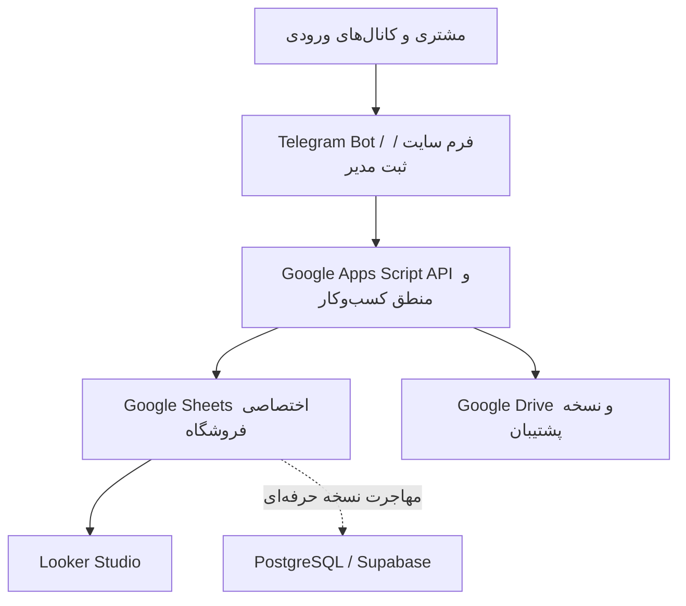

# سند طراحی CRM فروشگاهی مبتنی بر Google Sheets و Telegram

نسخه: 1.0

تاریخ: ۱۲ ژوئیه ۲۰۲۶

هدف: ساخت MVP رایگان و کم‌هزینه برای فروشگاه‌های دارای ۲ تا ۵ فروشنده، با مسیر ارتقا به محصول حرفه‌ای قابل‌فروش

---

## خلاصه تصمیم اجرایی

نسخه اول باید با **یک Google Spreadsheet اختصاصی برای هر فروشگاه، یک Telegram Bot اختصاصی و یک پروژه Google Apps Script اختصاصی** ساخته شود. مدیر فروشگاه مالک فایل است و فروشندگان کارهای روزانه را عمدتاً با ربات انجام می‌دهند. این مدل با هزینه نرم‌افزاری نزدیک به صفر، جداسازی مناسب اطلاعات مشتریان هر فروشگاه و امکان کپی‌کردن قالب برای مشتری بعدی را فراهم می‌کند.

هسته سیستم در MVP:

- Google Sheets: پایگاه داده موقت و گزارش‌های عملیاتی
- Google Apps Script: منطق کسب‌وکار، اعتبارسنجی، ربات، یادآوری و پشتیبان‌گیری
- Telegram Bot API: رابط روزانه فروشنده و اعلان‌ها
- Looker Studio: داشبورد مدیر
- Google Drive: پیش‌فاکتور، فایل‌ها و نسخه‌های پشتیبان

نسخه حرفه‌ای نباید یک Google Sheet مشترک برای همه فروشگاه‌ها باشد. در آن نسخه، PostgreSQL/Supabase با `tenant_id` و Row Level Security منبع اصلی داده می‌شود و Sheets فقط برای خروجی، واردکردن داده یا گزارش باقی می‌ماند.

> نکته مهم مجوز: n8n «متن‌باز OSI» نیست و تحت Sustainable Use License عرضه می‌شود. استفاده داخلی و ارائه خدمات مشاوره/ساخت Workflow مجاز است، اما وایت‌لیبل‌کردن n8n یا میزبانی و فروش دسترسی آن به مشتری مجاز نیست. در نتیجه n8n ابزار کمکی است، نه وابستگی حیاتی محصول تجاری. [مستند رسمی مجوز n8n](https://docs.n8n.io/sustainable-use-license/)

---

## مرحله ۱: پاسخ‌های مبنا و فرض‌های طراحی

| موضوع | تصمیم این پروژه |
|---|---|
| بازار هدف | فروشگاه‌ها و کسب‌وکارهای کوچک؛ قابل ارائه به مشتریان متعدد |
| تعداد کاربران هر فروشگاه | ۲ تا ۵ فروشنده + یک مدیر |
| کانال جذب | تماس، سایت، تلگرام، واتساپ، اینستاگرام، معرفی و تبلیغات |
| فرایند پیش‌فرض | استعلام ← تماس و نیازسنجی ← اعلام قیمت ← پیش‌فاکتور ← پیگیری ← پرداخت ← ارسال |
| فرایند فروش | قابل تعریف برای هر فروشگاه |
| فیلدهای استعلام | قابل تعریف براساس نوع کسب‌وکار |
| اعلان داخلی | فقط Telegram Bot |
| دامنه امکانات نهایی | CRM، فروش، پیش‌فاکتور، پرداخت، محصول، موجودی، تأمین‌کننده و ارسال |
| داده اولیه | داده فرضی برای تست؛ واردسازی واقعی در آینده |
| رابط MVP | Google Sheets برای مدیر + Telegram Bot برای مدیر و فروشنده |
| بودجه MVP | ابزارهای رایگان یا نسخه رایگان؛ بدون معرفی ابزار پولی به‌عنوان رایگان |

فرض‌های تکمیلی:

- زبان، برچسب‌ها و پیام‌ها فارسی و راست‌چین هستند.
- زمان اصلی سیستم با تاریخ/زمان استاندارد ISO ذخیره می‌شود؛ تاریخ شمسی فقط در نمایش استفاده می‌شود.
- مبلغ در داده‌ها با عدد صحیح و یک واحد پایه ذخیره می‌شود. پیشنهاد: همه مبالغ با **ریال** ذخیره و در تنظیمات نمایش به تومان/ریال انتخاب شود تا خطای ×۱۰ رخ ندهد.
- شماره موبایل ایران پیش از ذخیره به قالب استاندارد `+989xxxxxxxxx` تبدیل می‌شود.
- فروشنده مستقیماً به فایل کامل دسترسی ویرایش ندارد؛ عملیات روزانه را با ربات انجام می‌دهد.

---

## مرحله ۲: تحلیل نیاز کسب‌وکار

### مسئله‌های اصلی

1. استعلام در تماس یا شبکه اجتماعی وارد می‌شود ولی ثبت و پیگیری نمی‌شود.
2. اطلاعات مشتری، فرصت فروش و سفارش با هم مخلوط می‌شوند.
3. یک مشتری ممکن است چند استعلام و چند فرصت فروش داشته باشد.
4. وضعیت‌هایی مانند «نیازمند پیگیری» با مرحله واقعی فروش مخلوط می‌شوند.
5. مدیر تعداد تماس و فعالیت را می‌بیند، اما نمی‌داند کدام فعالیت به فروش منجر شده است.
6. فروشگاه‌ها فیلدها و مراحل متفاوتی دارند؛ قالب نباید فقط برای یک صنعت ثابت باشد.

### نتیجه طراحی

- **Customer** پرونده ثابت شخص/شرکت است.
- **Lead** هر ورودی یا استعلام جدید است؛ یک مشتری می‌تواند چند Lead داشته باشد.
- **Opportunity** فرصت فروش واجد شرایط است و در قیف حرکت می‌کند.
- **FollowUp** تعهد زمان‌دار فروشنده است.
- **Interaction** تاریخچه تماس، پیام، جلسه و یادداشت است.
- **Quotation** پیشنهاد قیمت یا پیش‌فاکتور است.
- **Order** فروش قطعی است.
- وضعیت قیف، وضعیت پیگیری و وضعیت چرخه عمر مشتری از هم جدا هستند.

اهداف قابل اندازه‌گیری MVP پس از ۳۰ روز استفاده:

- حداقل ۹۵٪ استعلام‌ها دارای مسئول و پیگیری بعدی باشند.
- پیگیری عقب‌افتاده بدون هشدار باقی نماند.
- نرخ تبدیل هر کانال و هر فروشنده محاسبه شود.
- هر سفارش به مشتری، فرصت فروش و پیش‌فاکتور مربوط متصل باشد.
- گزارش روزانه حداکثر ۵ دقیقه پس از پایان کار در تلگرام مدیر آماده باشد.

---

## مرحله ۳: معماری کلی سیستم

### الگوی چندفروشگاهی MVP

برای هر فروشگاه یک بسته جدا ساخته می‌شود:

`Store A = Sheet A + Script A + Bot A + Drive Folder A + Dashboard A`

مزایا:

- اطلاعات فروشگاه‌ها با هم مخلوط نمی‌شود.
- quota و خرابی یک فروشگاه روی بقیه اثر مستقیم ندارد.
- انتقال مالکیت به مشتری ساده‌تر است.
- سفارشی‌سازی مراحل و فیلدها بدون ایجاد شرط‌های پیچیده انجام می‌شود.

محدودیت: به‌روزرسانی قالب در ده‌ها فروشگاه سخت می‌شود. برای حل آن، همه اسکریپت‌ها باید `schema_version` و `app_version` داشته باشند و تغییرات با Migration Script نسخه‌دار اعمال شوند.

### رابط‌ها

- **مدیر:** شیت محافظت‌شده، داشبورد Looker، دستورات مدیریتی ربات
- **فروشنده:** فقط ربات؛ نمایش و تغییر رکوردهای مجاز خودش
- **مشتری:** در MVP تماس/سایت/پیام یا ارسال پیام مستقیم به بات؛ در نسخه بعد WhatsApp/Instagram رسمی
- **ارائه‌دهنده محصول:** فقط دسترسی پشتیبانی با رضایت مشتری؛ بدون دسترسی دائمی غیرضروری به داده

### ساختار قابل تعریف

سه جدول تنظیمی سیستم را انعطاف‌پذیر می‌کنند:

1. `PipelineStages`: مراحل، ترتیب، احتمال برد، SLA، اقدام و فیلدهای اجباری هر مرحله
2. `CustomFieldDefinitions`: فیلدهای اضافی برای مشتری، Lead، Opportunity، محصول یا سفارش
3. `AutomationRules`: رویداد، شرط و عمل؛ در MVP فقط عمل‌های از پیش تعریف‌شده و امن

فیلدهای حیاتی مانند شناسه، شماره موبایل، مبلغ، تاریخ، مسئول و وضعیت ثابت می‌مانند؛ فیلدهای خاص هر صنف در مدل فیلد سفارشی قرار می‌گیرند.

---

## مرحله ۴: معرفی و مقایسه ابزارها

| ابزار | کاربرد | مزیت | عیب/محدودیت | وضعیت هزینه | سختی | جایگزین |
|---|---|---|---|---|---|---|
| Google Sheets | داده MVP | آشنا، سریع، فیلتر و اشتراک آسان | تراکنش و امنیت سطری واقعی ندارد | بدون هزینه با حساب Google؛ سقف فنی هر فایل ۱۰ میلیون سلول | کم | PostgreSQL، Supabase، Baserow |
| Google Apps Script | API، Bot، اتوماسیون | یکپارچه با Sheets و Drive؛ بدون سرور جدا | quota، اجرای محدود و کنترل هم‌زمانی ضعیف‌تر از Backend واقعی | بدون هزینه در سهمیه حساب؛ سهمیه‌ها متغیرند | متوسط | Node.js Worker، Node-RED، n8n |
| Telegram Bot API | رابط فروشنده و اعلان | سریع، رایگان و مناسب ایران | فقط پیام‌هایی را می‌بیند که به bot/chat مجاز رسیده‌اند | ارسال معمول رایگان با rate limit | متوسط | پنل وب/PWA |
| Looker Studio | داشبورد مدیر | بدون هزینه، اتصال مستقیم به Sheets | کندشدن روی داده زیاد و مدل پیچیده | نسخه اصلی بدون هزینه | کم | Metabase، Grafana |
| Google Drive | فایل و Backup | ساده و دارای تاریخچه | فضای حساب و مدیریت مجوز | در سهمیه حساب | کم | S3-compatible/MinIO |
| Google Forms | ثبت ساده | راه‌اندازی سریع | UX ضعیف برای فرایند چندمرحله‌ای و کنترل دسترسی محدود | بدون هزینه | کم | فرم Apps Script، Tally |
| n8n Community | Workflow داخلی/نمونه‌سازی | کانکتورهای زیاد | نیازمند میزبانی؛ fair-code؛ فروش دسترسی میزبانی‌شده/white-label محدود است | نرم‌افزار self-host داخلی بدون هزینه مجوز، سرور رایگان نیست | متوسط/زیاد | Apps Script، Node-RED، کد اختصاصی |
| AppSheet | اپ موبایل بدون کد | سریع و متصل به Sheet | استفاده رایگان فقط برای ساخت/تست تا ۱۰ کاربر؛ استقرار عملی پولی | Starter فعلی ۵ دلار/کاربر/ماه | کم/متوسط | Telegram Bot، PWA اختصاصی |
| WhatsApp Business Platform | پیام رسمی WhatsApp | ورودی مهم و webhook رسمی | راه‌اندازی Meta، template و هزینه پیام؛ eligibility منطقه‌ای | Service message در پنجره ۲۴ساعته رایگان؛ بقیه بسته به دسته/کشور | زیاد | Telegram، تماس، فرم سایت |
| Instagram/Messenger API | ثبت پیام‌های حرفه‌ای | اتصال رسمی پیام‌ها | حساب حرفه‌ای، App Review، مجوزها و محدودیت پنجره پیام | معمولاً بدون هزینه API مستقیم؛ هزینه توسعه و تبلیغ جدا | زیاد | لینک فرم/تلگرام |
| Supabase/PostgreSQL | دیتابیس نسخه حرفه‌ای | امنیت، تراکنش، RLS، API | نیازمند توسعه Backend و نگهداری | Free plan برای شروع محدود است؛ برای تولید هزینه محتمل | زیاد | PostgreSQL خودمیزبان |

منابع و واقعیت‌های هزینه/محدودیت در تاریخ سند:

- سقف رسمی فایل Google Sheets برابر ۱۰ میلیون سلول است، اما آستانه عملی این CRM بسیار پایین‌تر در نظر گرفته می‌شود. [Google Drive Help](https://support.google.com/drive/answer/37603)
- سهمیه Apps Script برای حساب مصرف‌کننده شامل ۹۰ دقیقه runtime تریگر در روز، ۲۰٬۰۰۰ URL Fetch و ۱۰۰ گیرنده ایمیل در روز است و می‌تواند تغییر کند. [Apps Script quotas](https://developers.google.com/apps-script/guides/services/quotas)
- Looker Studio/Data Studio نسخه بدون هزینه دارد. [Google Cloud documentation](https://docs.cloud.google.com/looker/docs/studio-comparison)
- Telegram پیام معمول bot را بدون هزینه ارائه می‌کند؛ محدودیت تقریبی پخش رایگان ۳۰ پیام در ثانیه و هر گفت‌وگو حدود یک پیام در ثانیه است. [Telegram Bots FAQ](https://core.telegram.org/bots/faq)
- AppSheet رایگان برای prototype و حداکثر ۱۰ test user است؛ Starter برای استقرار از ۵ دلار به‌ازای کاربر در ماه اعلام شده است. [AppSheet Pricing](https://about.appsheet.com/pricing/)
- WhatsApp Platform براساس پیام تحویل‌شده و دسته/کشور قیمت‌گذاری می‌شود؛ Service message در پنجره ۲۴ساعته پاسخ رایگان است. [WhatsApp Business Platform Pricing](https://business.whatsapp.com/products/platform-pricing)

---

## مرحله ۵: طراحی Google Sheets

### قواعد مشترک همه شیت‌ها

- شناسه با UUID تولید شود؛ شماره ردیف شناسه نیست.
- زمان استاندارد در ستون‌های فنی با ISO-8601/Gregorian ذخیره و در رابط شمسی نمایش داده شود.
- ستون‌های `created_at`, `created_by`, `updated_at`, `updated_by`, `is_deleted` در موجودیت‌های اصلی وجود داشته باشند.
- حذف واقعی از ربات ممنوع؛ فقط soft delete.
- شماره موبایل normalize شده و کلید تکراری به صورت `normalized_mobile` نگهداری شود.
- مبلغ عدد صحیح باشد؛ واحد در `Settings.base_currency_unit` تعیین شود.
- ورودی‌های محدود با Data Validation و کدهای ثابت کنترل شوند.
- تمام ارتباط‌ها با ID انجام شود، نه نام.

### 5.1 Customers

| ستون | نام فارسی | نوع | الزام | مثال | اعتبارسنجی/رابطه |
|---|---|---:|---:|---|---|
| customer_id | شناسه مشتری | UUID | بله | `cus_...` | یکتا |
| customer_type | نوع | enum | بله | person/company | فهرست تنظیمات |
| full_name | نام مشتری/نماینده | text | بله | علی رضایی | ۲ تا ۱۲۰ حرف |
| company_name | فروشگاه/شرکت | text | خیر | فروشگاه آریا | — |
| normalized_mobile | موبایل استاندارد | phone | بله* | `+989121234567` | regex و یکتا در مشتری فعال |
| phone_2 | تماس دوم | phone | خیر | `+9831...` | normalize |
| city | شهر | text | خیر | اصفهان | فهرست اختیاری |
| region | منطقه | text | خیر | شاهین‌شهر | — |
| address | آدرس | long text | خیر | ... | حداکثر طول |
| lifecycle_status | چرخه عمر | enum | بله | active | new/active/loyal/at_risk/inactive |
| owner_user_id | مسئول اصلی | FK | بله | `usr_...` | Users |
| last_purchase_at | آخرین خرید | datetime | خودکار | 2026-07-01 | از Orders |
| total_purchase | جمع خرید | integer | خودکار | 850000000 | از Orders پرداخت/قطعی |
| purchase_count | تعداد خرید | integer | خودکار | 4 | ≥0 |
| last_interaction_at | آخرین ارتباط | datetime | خودکار | ... | از Interactions |
| next_followup_at | پیگیری بعدی | datetime | خودکار | ... | از FollowUps باز |
| customer_score | امتیاز | integer | خودکار | 72 | 0..100 |
| segment | گروه | enum | خودکار | loyal | مدل امتیازدهی |
| source_first | اولین کانال | enum | خیر | instagram | Campaign/Settings |
| preferred_products | علاقه‌مندی | text/IDs | خیر | `prd_1,prd_2` | در نسخه حرفه‌ای رابطه جدا |
| tags | برچسب‌ها | text | خیر | عمده،VIP | در نسخه حرفه‌ای EntityTags |
| notes | توضیحات | long text | خیر | ... | بدون اطلاعات حساس غیرضروری |
| created_at/by | ایجاد | datetime/FK | بله | ... | خودکار/Users |
| updated_at/by | تغییر | datetime/FK | بله | ... | خودکار/Users |
| is_deleted | حذف نرم | boolean | بله | FALSE | پیش‌فرض FALSE |

`*` اگر مشتری فقط با Telegram ID وارد شده، موبایل می‌تواند موقتاً خالی باشد ولی رکورد باید `needs_identity_completion=TRUE` بگیرد.

### 5.2 Leads

| ستون | فارسی | نوع | الزام | مثال | اعتبارسنجی/رابطه |
|---|---|---:|---:|---|---|
| lead_id | شناسه ورودی/استعلام | UUID | بله | `lead_...` | یکتا |
| customer_id | مشتری | FK | خیر | `cus_...` | Customers؛ پس از شناسایی اجباری |
| source_channel | کانال ورودی | enum | بله | website | Settings |
| campaign_id | کمپین | FK | خیر | `cmp_...` | Campaigns |
| external_message_id | شناسه پیام بیرونی | text | خیر | Telegram update id | یکتا با channel |
| subject | موضوع | text | بله | استعلام لپ‌تاپ | — |
| details | جزئیات | long text | خیر | ... | — |
| received_at | زمان ورود | datetime | بله | ... | خودکار |
| assigned_user_id | فروشنده | FK | بله | `usr_...` | Users فعال |
| qualification_status | نتیجه بررسی | enum | بله | new | new/qualified/unqualified/converted |
| qualification_reason | دلیل | text | خیر | بودجه نامناسب | در unqualified اجباری |
| opportunity_id | فرصت ساخته‌شده | FK | خیر | `opp_...` | Opportunities |
| created/updated/is_deleted | کنترل رکورد | mixed | بله | ... | قاعده مشترک |

### 5.3 Opportunities

| ستون | فارسی | نوع | الزام | مثال | اعتبارسنجی/رابطه |
|---|---|---:|---:|---|---|
| opportunity_id | شناسه فرصت | UUID | بله | `opp_...` | یکتا |
| customer_id | مشتری | FK | بله | `cus_...` | Customers |
| lead_id | ورودی اولیه | FK | خیر | `lead_...` | Leads |
| title | عنوان فرصت | text | بله | خرید ۲۰ دستگاه | — |
| pipeline_id | نوع فرایند | text/FK | بله | retail_default | Settings/Pipeline |
| stage_code | مرحله قیف | FK | بله | quote_sent | PipelineStages |
| owner_user_id | مسئول | FK | بله | `usr_...` | Users |
| expected_value | ارزش احتمالی | integer | خیر | 500000000 | ≥0 |
| probability | احتمال برد | percent | خودکار/قابل اصلاح | 60 | 0..100 |
| expected_close_at | تاریخ بسته‌شدن | date | خیر | ... | ≥ created_at |
| next_action | اقدام بعدی | text | بله تا بسته‌شدن | تماس درباره قیمت | — |
| next_followup_at | پیگیری بعدی | datetime | بله تا بسته‌شدن | ... | FollowUps |
| lost_reason_code | دلیل باخت | enum | شرطی | competitor | در lost اجباری |
| closed_at | زمان برد/باخت | datetime | شرطی | ... | در مراحل بسته |
| quotation_id | آخرین پیشنهاد | FK | خیر | `quo_...` | Quotations |
| created/updated/is_deleted | کنترل رکورد | mixed | بله | ... | قاعده مشترک |

### 5.4 FollowUps

| ستون | فارسی | نوع | الزام | مثال | اعتبارسنجی/رابطه |
|---|---|---:|---:|---|---|
| followup_id | شناسه پیگیری | UUID | بله | `fu_...` | یکتا |
| customer_id | مشتری | FK | بله | `cus_...` | Customers |
| opportunity_id | فرصت | FK | خیر | `opp_...` | Opportunities |
| assigned_user_id | مسئول | FK | بله | `usr_...` | Users |
| due_at | موعد | datetime | بله | ... | تاریخ معتبر |
| channel | روش | enum | بله | call | call/telegram/whatsapp/... |
| purpose | هدف | text | بله | پیگیری پیش‌فاکتور | — |
| status | وضعیت | enum | بله | open | open/done/snoozed/cancelled |
| reminder_count | تعداد هشدار | integer | خودکار | 1 | ≥0 |
| last_reminded_at | آخرین هشدار | datetime | خودکار | ... | — |
| completed_at | انجام | datetime | شرطی | ... | status=done |
| result_code | نتیجه | enum | شرطی | answered | در done اجباری |
| result_note | شرح نتیجه | text | خیر | درخواست تخفیف | — |
| next_followup_id | پیگیری بعدی | FK | خیر | `fu_...` | FollowUps |
| sequence_step | گام توالی | integer | خیر | 2 | ≥1 |
| idempotency_key | کلید اجرای یکتا | text | بله | ... | یکتا |
| created/updated/is_deleted | کنترل رکورد | mixed | بله | ... | قاعده مشترک |

### 5.5 Interactions

| ستون | فارسی | نوع | الزام | مثال | اعتبارسنجی/رابطه |
|---|---|---:|---:|---|---|
| interaction_id | شناسه تعامل | UUID | بله | `int_...` | یکتا |
| customer_id | مشتری | FK | بله | `cus_...` | Customers |
| opportunity_id | فرصت | FK | خیر | `opp_...` | Opportunities |
| user_id | فروشنده | FK | خیر | `usr_...` | Users/system |
| interaction_type | نوع | enum | بله | phone_call | تماس/Telegram/WhatsApp/جلسه/شکایت/... |
| direction | جهت | enum | بله | inbound | inbound/outbound/internal |
| occurred_at | زمان | datetime | بله | ... | — |
| summary | خلاصه | text | بله | قیمت اعلام شد | — |
| result_code | نتیجه | enum | خیر | answered | Settings |
| next_action | اقدام بعدی | text | خیر | ارسال پیش‌فاکتور | — |
| external_message_id | شناسه بیرونی | text | خیر | ... | یکتا با channel |
| attachment_url | فایل | URL | خیر | Drive URL | فقط پوشه مجاز |
| created_at/by/is_deleted | کنترل | mixed | بله | ... | مشترک |

### 5.6 Orders

| ستون | فارسی | نوع | الزام | مثال | اعتبارسنجی/رابطه |
|---|---|---:|---:|---|---|
| order_id | شناسه داخلی | UUID | بله | `ord_...` | یکتا |
| order_number | شماره نمایش | text | بله | 1405-00031 | یکتا |
| customer_id | مشتری | FK | بله | `cus_...` | Customers |
| opportunity_id | فرصت | FK | خیر | `opp_...` | Opportunities |
| quotation_id | پیش‌فاکتور | FK | خیر | `quo_...` | Quotations |
| seller_user_id | فروشنده | FK | بله | `usr_...` | Users |
| order_at | تاریخ سفارش | datetime | بله | ... | — |
| subtotal | جمع اقلام | integer | خودکار | ... | از OrderItems |
| discount_amount | تخفیف | integer | بله | 0 | 0..subtotal |
| shipping_amount | حمل | integer | بله | 0 | ≥0 |
| final_amount | مبلغ نهایی | integer | خودکار | ... | subtotal-discount+shipping+tax |
| payment_status | پرداخت | enum | بله | partial | unpaid/partial/paid/refunded |
| order_status | سفارش | enum | بله | confirmed | draft/confirmed/preparing/shipped/delivered/cancelled |
| delivery_due_at | موعد تحویل | datetime | خیر | ... | — |
| delivered_at | تحویل واقعی | datetime | شرطی | ... | status=delivered |
| notes | توضیحات | text | خیر | ... | — |
| created/updated/is_deleted | کنترل | mixed | بله | ... | مشترک |

اقلام سفارش در شیت افزوده `OrderItems` نگهداری می‌شوند؛ قراردادن چند محصول در یک سلول ممنوع است.

### 5.7 Products

| ستون | فارسی | نوع | الزام | مثال | اعتبارسنجی/رابطه |
|---|---|---:|---:|---|---|
| product_id | شناسه محصول | UUID | بله | `prd_...` | یکتا |
| sku | کد کالا | text | بله | LAP-001 | یکتا |
| name | نام | text | بله | لپ‌تاپ مدل X | — |
| category | دسته | text | بله | دیجیتال | Settings |
| unit | واحد | enum | بله | عدد | Settings |
| sale_price | قیمت فروش | integer | خیر | ... | ≥0 |
| cost_price | بهای خرید | integer | خیر/حساس | ... | فقط مدیر |
| reorder_level | نقطه سفارش | number | خیر | 5 | ≥0 |
| current_stock | موجودی نمایشی | formula | خودکار | 12 | از InventoryTransactions |
| active | فعال | boolean | بله | TRUE | — |
| created/updated/is_deleted | کنترل | mixed | بله | ... | مشترک |

### 5.8 Tasks

| ستون | فارسی | نوع | الزام | مثال | اعتبارسنجی/رابطه |
|---|---|---:|---:|---|---|
| task_id | شناسه کار | UUID | بله | `tsk_...` | یکتا |
| related_type/id | موجودیت مرتبط | enum/FK | خیر | order/ord_... | شناسه معتبر |
| title | عنوان | text | بله | کنترل موجودی | — |
| assigned_user_id | مسئول | FK | بله | `usr_...` | Users |
| priority | اولویت | enum | بله | high | low/normal/high/urgent |
| due_at | موعد | datetime | خیر | ... | — |
| status | وضعیت | enum | بله | open | open/in_progress/done/cancelled |
| completed_at | پایان | datetime | شرطی | ... | done |
| notes | شرح | text | خیر | ... | — |
| created/updated/is_deleted | کنترل | mixed | بله | ... | مشترک |

### 5.9 Users

| ستون | فارسی | نوع | الزام | مثال | اعتبارسنجی/رابطه |
|---|---|---:|---:|---|---|
| user_id | شناسه کاربر | UUID | بله | `usr_...` | یکتا |
| full_name | نام | text | بله | سارا محمدی | — |
| role | نقش | enum | بله | seller | owner/manager/seller/viewer |
| telegram_user_id | شناسه تلگرام | integer/text | بله برای bot | 12345678 | یکتا |
| telegram_chat_id | چت اعلان | integer/text | خیر | ... | معتبر |
| email | ایمیل | email | خیر | ... | format |
| active | فعال | boolean | بله | TRUE | — |
| data_scope | دامنه دسترسی | enum | بله | own | own/team/all |
| created_at/by | ایجاد | mixed | بله | ... | فقط مدیر |

هیچ رمز عبور یا Telegram token در این شیت ذخیره نمی‌شود.

### 5.10 Campaigns

| ستون | فارسی | نوع | الزام | مثال | اعتبارسنجی/رابطه |
|---|---|---:|---:|---|---|
| campaign_id | شناسه کمپین | UUID | بله | `cmp_...` | یکتا |
| name | نام | text | بله | تبلیغ تابستان | — |
| channel | کانال | enum | بله | instagram | Settings |
| start_at/end_at | بازه | date | خیر | ... | end≥start |
| budget | بودجه | integer | خیر | ... | ≥0 |
| tracking_code | کد رهگیری | text | خیر | IG-SUMMER | یکتا |
| leads_count | تعداد ورودی | formula | خودکار | 30 | Leads |
| won_revenue | درآمد برده | formula | خودکار | ... | Orders/Opps |
| status | وضعیت | enum | بله | active | draft/active/paused/ended |
| created/updated/is_deleted | کنترل | mixed | بله | ... | مشترک |

### 5.11 MessageTemplates

| ستون | فارسی | نوع | الزام | مثال | اعتبارسنجی/رابطه |
|---|---|---:|---:|---|---|
| template_id | شناسه | UUID | بله | `tpl_...` | یکتا |
| code | کد ثابت | text | بله | followup_1 | یکتا |
| channel | کانال | enum | بله | telegram | — |
| purpose | هدف | enum | بله | reminder | — |
| body_fa | متن فارسی | long text | بله | سلام {{name}}... | متغیرهای مجاز |
| variables | متغیرها | text/json | بله | name,due_at | whitelist |
| requires_opt_in | رضایت لازم | boolean | بله | FALSE | برای marketing TRUE |
| official_template_id | شناسه Meta | text | خیر | ... | WhatsApp template |
| active | فعال | boolean | بله | TRUE | — |
| updated_at/by | تغییر | mixed | بله | ... | فقط مدیر |

### 5.12 Settings

| ستون | فارسی | نوع | الزام | مثال | اعتبارسنجی/رابطه |
|---|---|---:|---:|---|---|
| setting_key | کلید | text | بله | timezone | یکتا |
| setting_value | مقدار | text | بله | Asia/Tehran | براساس data_type |
| data_type | نوع | enum | بله | text | text/number/boolean/json |
| category | گروه | text | بله | localization | — |
| editable_by | قابل تغییر توسط | enum | بله | owner | — |
| description | توضیح | text | خیر | ... | — |
| updated_at/by | تغییر | mixed | بله | ... | — |

تنظیمات نمونه: timezone، واحد پایه پول، واحد نمایش، الگوی شماره سفارش، زمان گزارش روزانه، روزهای ریزش، ترتیب پیگیری و نسخه schema. توکن‌ها در این شیت ممنوع‌اند.

### 5.13 ActivityLogs

| ستون | فارسی | نوع | الزام | مثال | اعتبارسنجی/رابطه |
|---|---|---:|---:|---|---|
| log_id | شناسه لاگ | UUID | بله | `log_...` | یکتا |
| event_key | کلید رویداد | text | بله | TG:12345 | یکتا برای idempotency |
| occurred_at | زمان | datetime | بله | ... | خودکار |
| actor_type/id | عامل | enum/text | بله | user/usr_... | user/system/api |
| action | عملیات | enum | بله | UPDATE_STAGE | فهرست ثابت |
| entity_type/id | رکورد | enum/FK | بله | opportunity/opp_... | — |
| before_json | قبل | json/text | خیر | {...} | داده حساس حداقلی |
| after_json | بعد | json/text | خیر | {...} | داده حساس حداقلی |
| status | نتیجه | enum | بله | success | success/failed/skipped |
| error_code | کد خطا | text | خیر | DUPLICATE | — |
| correlation_id | شناسه زنجیره | text | خیر | ... | ردیابی workflow |

این شیت append-only و برای فروشنده غیرقابل ویرایش است؛ در نسخه حرفه‌ای لاگ خارج از دیتابیس عملیاتی نگهداری می‌شود.

### 5.14 DashboardData

| ستون | فارسی | نوع | الزام | مثال | اعتبارسنجی/رابطه |
|---|---|---:|---:|---|---|
| snapshot_at | زمان محاسبه | datetime | بله | ... | یکتا با metric/dimension |
| metric_code | کد شاخص | text | بله | sales_month | فهرست KPI |
| dimension_type | نوع بُعد | text | خیر | seller | seller/channel/city/... |
| dimension_value | مقدار بُعد | text | خیر | usr_1 | ID یا code |
| period_type | دوره | enum | بله | month | day/week/month/rolling |
| period_start/end | بازه | date | بله | ... | معتبر |
| metric_value | مقدار | number | بله | 125000000 | عدد |
| calculated_at | محاسبه | datetime | بله | ... | خودکار |
| data_version | نسخه | integer | بله | 1 | — |

Looker Studio ترجیحاً از این جدول خلاصه و Viewهای تمیز تغذیه شود، نه از فرمول‌های سنگین روی همه شیت‌ها.

### شیت‌های تکمیلی لازم برای «تمام‌وکمال» شدن

| شیت | کاربرد | ستون‌های اصلی |
|---|---|---|
| `PipelineStages` | فرایند قابل تعریف | pipeline_id, stage_code, label_fa, sequence, probability, sla_hours, default_followup_days, required_field_keys, is_closed, outcome |
| `CustomFieldDefinitions` | تعریف فیلد صنفی | field_id, entity_type, field_key, label_fa, data_type, required, options_json, active, sort_order |
| `CustomFieldValues` | مقدار فیلدها | value_id, entity_type, entity_id, field_id, value_text, value_number, value_date, value_boolean |
| `AutomationRules` | قواعد قابل تنظیم | rule_id, event_code, condition_json, action_code, delay_minutes, active, priority |
| `FollowUpSequences` | الگوی ۱/۳/۷/۱۴ | sequence_id, step_no, delay_days, channel, template_id, stop_on_reply |
| `ContactChannels` | اتصال هویت شبکه | channel_id, customer_id, platform, platform_user_id, normalized_mobile, consent_status, last_message_at |
| `Quotations` | سربرگ پیش‌فاکتور | quotation_id, number, customer_id, opportunity_id, valid_until, subtotal, discount, final_amount, status, file_url |
| `QuotationItems` | اقلام پیش‌فاکتور | item_id, quotation_id, product_id, description, qty, unit, unit_price, discount, total |
| `OrderItems` | اقلام سفارش | item_id, order_id, product_id, description, qty, unit, unit_price, discount, total |
| `Payments` | پرداخت‌ها | payment_id, order_id, amount, method, reference, paid_at, status, attachment_url |
| `InventoryTransactions` | گردش موجودی | transaction_id, product_id, type, qty, unit_cost, related_type/id, occurred_at |
| `Suppliers` | تأمین‌کنندگان | supplier_id, name, mobile, city, categories, score, status |
| `SupplierQuotes` | استعلام خرید | supplier_quote_id, supplier_id, lead/opportunity_id, product_id, qty, price, valid_until, status |
| `Shipments` | ارسال | shipment_id, order_id, carrier, tracking_code, shipped_at, delivered_at, status |
| `FailureReasons` | دلایل باخت | reason_code, label_fa, category, active |

### داده فرضی نمونه

| مشتری | ورودی | فرصت | مرحله | پیگیری | سفارش |
|---|---|---|---|---|---|
| علی رضایی / فروشگاه آریا | تماس | خرید ۲۰ واحد محصول A | quote_sent | فردا ۱۰:۰۰ | — |
| سارا محمدی | Instagram | خرید محصول B | needs_analysis | امروز ۱۵:۳۰ | — |
| شرکت بهین | سایت | تمدید سفارش ماهانه | negotiation | امروز ۱۲:۰۰ | ۸۵۰٬۰۰۰٬۰۰۰ ریال |
| مهدی اکبری | معرفی | محصول C | won | انجام شده | ۱۲۰٬۰۰۰٬۰۰۰ ریال |
| فروشگاه سپهر | Telegram | استعلام محصول A | lost | — | دلیل: عدم پاسخ |

---
## مرحله ۶: قیف فروش و چرخه عمر مشتری

### اصل طراحی

این سه مفهوم نباید در یک ستون مخلوط شوند:

| مفهوم | نمونه | محل ذخیره |
|---|---|---|
| مرحله فروش | قیمت ارسال شد، مذاکره | Opportunities.stage_code |
| وضعیت کار | پیگیری امروز، عقب‌افتاده | FollowUps.status + due_at |
| چرخه عمر مشتری | فعال، وفادار، در معرض ریزش | Customers.lifecycle_status |

### قیف پیش‌فرض قابل ویرایش

| مرحله | شرط ورود | اقدام فروشنده | پیگیری خودکار | شرط خروج | هشدار/پیام |
|---|---|---|---|---|---|
| سرنخ جدید | Lead تازه و هنوز بررسی نشده | بررسی هویت، ثبت نیاز و تعیین مسئول | حداکثر ۳۰ دقیقه/طبق SLA | تماس اولیه ثبت شود یا رد صلاحیت شود | هشدار اگر تا SLA بدون مالک/تماس ماند |
| تماس اولیه | اولین تماس/پیام انجام شد | ثبت نتیجه و زمان مناسب ادامه | در صورت بی‌پاسخی T+1 | نیاز مشخص یا Lead نامعتبر شود | «نتیجه تماس ثبت نشده» |
| نیازسنجی | حداقل نیاز، بودجه/مقدار و زمان مشخص شد | تکمیل فیلدهای اجباری صنف | همان روز یا T+1 | آماده قیمت یا نامعتبر | لیست فیلدهای ناقص |
| اعلام قیمت | پیشنهاد شفاهی/قیمت اولیه ثبت شد | تأیید دریافت و اعتبار قیمت | T+1 | پیش‌فاکتور یا رد | یادآوری انقضای قیمت |
| پیش‌فاکتور | Quotation با اقلام و اعتبار ساخته شد | ارسال و ثبت کانال ارسال | T+1، T+3، T+7، T+14 | پاسخ/مذاکره/برد/باخت | هشدار نزدیک انقضا |
| در انتظار پاسخ | مشتری پیشنهاد را گرفته است | پیگیری طبق ترجیح مشتری | توالی قابل تنظیم | پاسخ، انقضا یا پایان توالی | هشدار پیگیری overdue |
| مذاکره | بحث قیمت/شرایط/تحویل فعال است | ثبت مانع، تصمیم‌گیرنده و اقدام بعدی | ۱ تا ۳ روز | توافق یا باخت | فرصت بدون اقدام بعدی ممنوع |
| فروش موفق | سفارش Confirmed یا پرداخت معیار فروش ثبت شد | هماهنگی پرداخت/ارسال و درخواست رضایت | پیگیری تحویل و پس از فروش | چرخه فروش بسته | پیام داخلی تبریک + کارهای تحویل |
| فروش ناموفق | دلیل باخت ثبت شد | ثبت رقیب/قیمت/زمان بازگشت | در صورت مجاز، Reactivation در ۳۰/۶۰/۹۰ روز | فرصت بسته؛ ایجاد فرصت جدید در آینده | گزارش دلیل باخت برای مدیر |

`نیازمند پیگیری` و `عقب‌افتاده` مرحله قیف نیستند؛ وضعیت محاسباتی هستند. این جداسازی باعث می‌شود گزارش قیف تحریف نشود.

### تنظیم هر فرایند در PipelineStages

مدیر می‌تواند برای هر صنف یا نوع فروش یک pipeline بسازد. برای نمونه:

- فروش سریع فروشگاهی: New → Contacted → Quote → Won/Lost
- فروش B2B: New → Qualification → Quote → Negotiation → Contract → Won/Lost
- خدمات: New → Assessment → Proposal → Scheduled → Delivered → Won/Lost

هر مرحله دارای `stage_code` ثابت و `label_fa` قابل تغییر است. Automation به code متصل می‌شود تا تغییر نام فارسی، سیستم را خراب نکند.

### چرخه عمر مشتری

| وضعیت | قانون پیشنهادی | اقدام |
|---|---|---|
| جدید | هنوز خرید قطعی ندارد یا کمتر از ۳۰ روز از ایجاد گذشته | تکمیل شناخت و اولین خرید |
| فعال | در بازه خرید طبیعی صنف خرید کرده است | پیشنهاد مکمل و حفظ پاسخ‌گویی |
| وفادار | امتیاز ≥۷۵ و حداقل ۳ خرید و بدون شکایت باز | خدمات ویژه، معرفی و نگهداری |
| در معرض ریزش | ۱٫۵ برابر چرخه خرید معمول گذشته یا امتیاز افت کرده | تماس انسانی و بررسی علت |
| غیرفعال | ۲ برابر چرخه خرید یا بیشتر بدون خرید | کمپین بازگشت با رضایت مشتری |

چرخه خرید طبیعی باید برای هر فروشگاه یا دسته محصول در Settings تعریف شود؛ مثلاً ۳۰، ۶۰ یا ۱۸۰ روز. یک عدد ثابت برای همه صنف‌ها اشتباه است.

---

## مرحله ۷: یادآوری‌ها و اتوماسیون‌ها

### برنامه پیگیری پیش‌فرض

پس از ارسال پیش‌فاکتور:

- گام ۱: یک روز بعد؛ تأیید دریافت و سؤال کوتاه
- گام ۲: سه روز بعد؛ بررسی مانع خرید
- گام ۳: هفت روز بعد؛ پیشنهاد تصمیم یا به‌روزرسانی قیمت
- گام ۴: چهارده روز بعد؛ جمع‌بندی محترمانه و تعیین زمان تماس آینده

قواعد توقف:

- با پاسخ مشتری، توالی خودکار متوقف و اقدام بعدی دستی/جدید ساخته شود.
- با Won/Lost تمام پیگیری‌های باز همان فرصت لغو شوند.
- Snooze تاریخ جدید می‌خواهد و بدون تاریخ مجاز نیست.
- پیام بازاریابی فقط با رضایت معتبر ارسال شود.

### جدول طراحی ۱۵ اتوماسیون

| # | اتوماسیون | Trigger و مراحل | ابزار/ورودی → خروجی | خطا، جلوگیری از تکرار و تست |
|---:|---|---|---|---|
| 1 | ثبت مشتری جدید | فرمان bot/form → normalize موبایل → بررسی تکرار → UUID → ذخیره | Apps Script؛ اطلاعات پایه → Customer | `LockService`؛ event_key؛ تست شماره‌های 09/+98/0098 |
| 2 | جلوگیری از تکرار | پیش از create، تطبیق موبایل؛ سپس Telegram ID؛ در نهایت هشدار شباهت نام+شرکت | Customers/ContactChannels → رکورد موجود یا پیشنهاد Merge | ادغام خودکار براساس نام ممنوع؛ تست false positive |
| 3 | اولین پیگیری | ایجاد Lead/Opportunity → خواندن SLA مرحله → FollowUp | PipelineStages → FollowUp + پیام مسئول | کلید `FIRST_FU:{opp_id}:{stage}`؛ تست یک‌بار و retry |
| 4 | یادآوری موعد | تریگر هر ۵ دقیقه/زمان‌دار → due نزدیک → ارسال Telegram | FollowUps + Users → notification | کلید `REM:{fu_id}:{due_at}`؛ retry محدود؛ تست timezone |
| 5 | هشدار عقب‌افتاده | هر ۱۵ دقیقه → open و due<now → هشدار فروشنده؛ escalation مدیر طبق SLA | FollowUps → Telegram | reminder_count و cooldown؛ تست عدم spam |
| 6 | ثبت پیام Telegram | update → نقش فرستنده → match ContactChannel → Interaction/Lead | Telegram webhook → Interactions | `TG:{update_id}` یکتا؛ پیام نامعتبر quarantine؛ تست replay |
| 7 | تغییر مرحله | ثبت تعامل/quotation/order → ارزیابی rule → پیشنهاد/تغییر مرحله | AutomationRules → Opportunity | فقط transition مجاز؛ ActivityLog؛ تست مسیرهای ممنوع |
| 8 | مشتری غیرفعال | job شبانه → days_since_purchase > inactive_days | Customers/Orders → lifecycle_status | snapshot date در event key؛ تست مرزی |
| 9 | در معرض ریزش | job شبانه → 1.5×cycle یا کاهش score/شکایت | Orders/Interactions → at_risk + Task | یک task باز به‌ازای مشتری؛ تست مشتری جدید |
| 10 | پیام بازگشت | at_risk/inactive + consent + template فعال → صف ارسال | MessageTemplates → Telegram/کانال رسمی | opt-out، rate limit، event key؛ A/B تست کوچک |
| 11 | گزارش روزانه | زمان Settings → تجمیع فروش/پیگیری/قیف → مدیر | DashboardData → Telegram report | یک گزارش در روز/فروشگاه؛ تست روز تعطیل |
| 12 | گزارش هفتگی | پایان هفته تنظیمی → مقایسه هفته قبل | Orders/Leads/FollowUps → مدیر | snapshot immutable؛ تست بازه شمسی/میلادی |
| 13 | سفارش و جمع خرید | Confirm/Pay/Cancel order → محاسبه اقلام/پرداخت → refresh Customer aggregates | Orders/Items/Payments → Customer/KPI | کلید `ORDER_AGG:{id}:{version}`؛ reconciliation شبانه |
| 14 | امتیازدهی | شبانه و پس از رویداد مهم → محاسبه score/segment | Customers + related → score | score_version؛ تست ۱۰ persona فرضی |
| 15 | نسخه پشتیبان | روزانه → copy Spreadsheet/Export CSV → پوشه تاریخ‌دار → retention | Drive → backup + log | checksum/count؛ اعلان شکست؛ تست بازیابی ماهانه |

### چارچوب اجرای مطمئن

- هر رویداد `event_key` یکتا دارد و قبل از اجرا در ActivityLogs/ProcessedEvents بررسی می‌شود.
- هنگام نوشتن از `LockService` استفاده می‌شود تا دو فروشنده یک ردیف را هم‌زمان خراب نکنند.
- عملیات چندمرحله‌ای `correlation_id` دارد؛ اگر مرحله‌ای شکست خورد وضعیت `failed` و Task مدیریتی ایجاد می‌شود.
- Retry فقط برای خطای موقت و حداکثر ۳ بار با فاصله افزایشی انجام شود.
- هر شب Reconciliation مجموع سفارش، پرداخت، موجودی و امتیاز را دوباره محاسبه و اختلاف را گزارش کند.

---

## مرحله ۸: داشبوردها و شاخص‌ها

### داشبوردهای پیشنهادی

| داشبورد | مخاطب | فقط چه چیزی نشان دهد؟ |
|---|---|---|
| مدیر | مالک | فروش، قیف، پیگیری عقب‌افتاده، ارزش فرصت باز، ریسک و روند |
| فروشنده | فروشنده | کارهای امروز، overdue شخصی، فرصت‌های بدون اقدام بعدی، هدف و تبدیل خودش |
| مشتریان | مدیر فروش | جدید/فعال/وفادار/ریزش، ارزش مشتری و شهر |
| فروش | مدیر | فروش زمانی، مبلغ متوسط، پرداخت و حاشیه سود در صورت مجوز |
| پیگیری | مدیر/فروشنده | due/done/overdue، SLA و نتیجه تماس‌ها |
| بازاریابی | مدیر | Lead، نرخ تبدیل و درآمد هر source/campaign |
| وفاداری و ریزش | مدیر | cohort، خرید مجدد، مشتریان at-risk و واکنش به بازگشت |
| محصولات | مدیر خرید | پرفروش/کم‌فروش، موجودی، نقطه سفارش و سود ناخالص |

### تعریف KPIها

فرمول‌ها به شکل منطقی نوشته شده‌اند و در پیاده‌سازی با `QUERY`, `SUMIFS`, `COUNTIFS` یا تجمیع Apps Script به `DashboardData` تبدیل می‌شوند.

| شاخص | فرمول | منبع | نمودار | تصمیم |
|---|---|---|---|---|
| فروش امروز/هفته/ماه | Σ `Orders.final_amount` برای سفارش غیرلغو در بازه | Orders | Scorecard | سرعت فروش و نیاز به اقدام فوری |
| فروش مقایسه ماهانه | فروش ماه جاری در برابر ماه قبل و سال قبل | Orders | Line/Column | تشخیص رشد و فصل |
| مشتری جدید | COUNT customer با created_at در بازه | Customers | Scorecard + line | اثر جذب |
| فعال/غیرفعال | COUNT براساس lifecycle_status | Customers | Stacked bar | برنامه حفظ/بازگشت |
| پیگیری امروز | COUNT open با due_at امروز | FollowUps | Scorecard | ظرفیت روز فروشندگان |
| انجام‌شده | done / همه پیگیری سررسیدشده | FollowUps | Gauge/Bar | انضباط پیگیری |
| عقب‌افتاده | COUNT open و due_at<now | FollowUps | Scorecard قرمز | Escalation و توزیع کار |
| نرخ تبدیل Lead | opportunities won / leads واجد شرایط ×100 | Leads, Opportunities | Funnel/Scorecard | کیفیت جذب و فروش |
| قیف فروش | COUNT/Σvalue در هر stage | Opportunities | Funnel | گلوگاه مرحله‌ای |
| ارزش فرصت باز | Σ expected_value برای stage باز | Opportunities | Scorecard | ظرفیت درآمد آینده |
| ارزش وزنی قیف | Σ expected_value × probability | Opportunities | Scorecard/Bar | Forecast محافظه‌کارانه |
| متوسط مبلغ خرید | Σ فروش / COUNT سفارش قطعی | Orders | Scorecard + trend | Upsell و ترکیب محصول |
| تعداد خرید مشتری | COUNT order به‌ازای customer | Orders | Histogram/Table | شناسایی VIP |
| نرخ بازگشت مشتری | مشتری با ≥۲ خرید / مشتری خریدار ×100 | Orders | Scorecard/cohort | وفاداری واقعی |
| مشتری در معرض ریزش | COUNT lifecycle=at_risk | Customers | Table + bar | اولویت تماس حفظ مشتری |
| محصولات پرفروش | Σ qty یا revenue بر product | OrderItems | Horizontal bar | موجودی و خرید |
| محصولات کم‌فروش | qty/revenue پایین با موجودی مثبت | Items, Inventory | Table | تخفیف/حذف/اصلاح عرضه |
| فروش فروشنده | Σ final_amount بر seller | Orders | Ranked bar | آموزش/پاداش؛ نه بدون توجه به lead quality |
| فروش شهر | Σ فروش بر customer.city | Orders, Customers | Map/Bar | منطقه هدف |
| فروش کانال | Σ won revenue بر first/last source | Leads, Orders | Bar | بودجه کانال |
| بهترین کانال | Revenue یا profit / lead و conversion | Campaigns, Leads, Orders | Bubble/Table | تخصیص بودجه؛ فقط تعداد Lead کافی نیست |
| دلایل باخت | COUNT lost بر reason_code | Opportunities | Bar/Pareto | اصلاح قیمت/اعتماد/ارسال |
| زمان تبدیل | AVG(closed_at - lead.received_at) برای won | Leads, Opportunities | Line/Box | کاهش طول چرخه |
| پیش‌بینی ساده | Weighted pipeline + run-rate تاریخی | Opportunities, Orders | Line + confidence note | خرید/نقدینگی؛ پیش‌بینی قطعی نیست |
| وصول مطالبات | Σ paid / Σ final_amount | Payments, Orders | Scorecard | پیگیری پرداخت |
| موجودی زیر نقطه سفارش | current_stock≤reorder_level | Products, Inventory | Alert table | سفارش خرید |

تعریف «فروش» باید در Settings مشخص باشد: سفارش Confirmed، پرداخت کامل یا تحویل. پیشنهاد برای گزارش مالی: فروش قطعی براساس سفارش Confirmed و وصول جداگانه براساس Payments گزارش شود.

---

## مرحله ۹: Telegram و شبکه‌های اجتماعی

### طراحی Telegram Bot

یک bot می‌تواند هم کاربران داخلی و هم مشتریان را تشخیص دهد:

- اگر `telegram_user_id` در Users فعال باشد: منوی کارمند
- اگر در ContactChannels باشد: پرونده مشتری و ثبت تعامل
- اگر هیچ‌کدام نباشد: درخواست نام و Share Contact؛ سپس ایجاد Lead/Customer

دستورات اصلی:

| دستور | کارکرد |
|---|---|
| `/newcustomer` | ایجاد/یافتن مشتری با موبایل و فیلدهای تعریف‌شده |
| `/newlead` | ثبت استعلام و اتصال به مشتری |
| `/followup` | ساخت پیگیری با تاریخ و ساعت |
| `/today` | پیگیری‌های امروز کاربر |
| `/overdue` | موارد عقب‌افتاده |
| `/search` | جست‌وجو با موبایل، نام یا شماره سفارش |
| `/addnote` | ثبت تماس/یادداشت و اقدام بعدی |
| `/stage` | تغییر مرحله با کنترل transition و فیلد اجباری |
| `/quote` | ثبت/جست‌وجوی پیش‌فاکتور |
| `/newsale` | ثبت سفارش از فرصت |
| `/payment` | ثبت پرداخت |
| `/inventory` | استعلام موجودی مجاز |
| `/report` | گزارش نقش‌محور |
| `/cancel` | لغو wizard جاری بدون ثبت ناقص |

برای UX بهتر، فرمان‌ها ورودی اولیه هستند و ادامه کار با Inline Keyboard و wizard مرحله‌ای انجام می‌شود. وضعیت wizard کوتاه‌مدت در `UserSessions`/Cache نگهداری می‌شود و رکورد ناقص تا تأیید نهایی وارد جداول اصلی نمی‌شود.

### جریان ثبت استعلام با bot

1. انتخاب «استعلام جدید».
2. ورود یا Share Contact.
3. normalize و جست‌وجوی مشتری تکراری.
4. انتخاب مشتری موجود یا ایجاد جدید.
5. خواندن فیلدهای فعال `CustomFieldDefinitions` برای Lead.
6. ثبت Lead و در صورت واجدشرایط Opportunity.
7. تعیین مرحله، مسئول و اولین FollowUp.
8. نمایش خلاصه و دکمه ویرایش/تأیید.

### اتصال رسمی کانال‌ها

| کانال | دریافت/پاسخ رسمی | نیازمندی | هزینه/محدودیت | اتصال به مشتری و جلوگیری از تکرار |
|---|---|---|---|---|
| Telegram | Bot API، webhook | BotFather، HTTPS endpoint، Telegram ID مجاز | معمولاً رایگان با rate limit | platform_user_id؛ سپس موبایل normalize شده |
| WhatsApp | Cloud API/Webhook | Meta Business، WABA، شماره تجاری، app و احتمالاً verification | service در پنجره ۲۴ ساعت رایگان؛ template/marketing بسته به کشور و دسته پولی | wa_id/phone؛ شماره موبایل کلید اصلی |
| Instagram | Instagram Messaging API | حساب Professional، Meta app، token، permissions و App Review | API مستقیم معمولاً هزینه پیام ندارد؛ پنجره‌ها و permission محدود | Instagram scoped user id؛ درخواست موبایل برای Merge قطعی |
| Facebook | Messenger Platform/Webhook | Facebook Page، app، token، permission | پنجره پیام و opt-in؛ تبلیغات جداگانه پولی | PSID؛ اتصال با موبایل یا تأیید مدیر |
| سایت | webhook فرم اختصاصی | امضای درخواست/CSRF، UTM | هزینه هاست سایت | موبایل normalize + source/UTM |
| تماس تلفنی | ثبت دستی یا PBX API در آینده | شماره تماس و Caller ID مجاز | وابسته به سرویس تلفنی | normalized phone |

قانون Match:

1. `platform + platform_user_id` تطبیق قطعی کانال؛
2. موبایل استاندارد تطبیق قطعی مشتری؛
3. ایمیل فقط در صورت verified؛
4. شباهت نام/شرکت فقط پیشنهاد ادغام به مدیر، نه Merge خودکار.

پاسخ خودکار فقط برای تأیید دریافت، ساعات کاری، شماره پیگیری و پرسش ساختاری مجاز باشد. قیمت، تخفیف، تعهد موجودی و تصمیم حساس بدون Rule قطعی یا تأیید انسان ارسال نشود.

برای فروشگاه‌های ایران، دسترسی واقعی به Meta Business/verification/پرداخت و محدودیت‌های منطقه‌ای باید پیش از فروش قابلیت WhatsApp یا Instagram به‌صورت عملی تست شود؛ این قابلیت نباید در قرارداد MVP «تضمین‌شده» نوشته شود.

---

## مرحله ۱۰: امنیت، حریم خصوصی و پشتیبان‌گیری

### نقش‌ها

| نقش | دسترسی |
|---|---|
| Owner | همه تنظیمات، کاربران، صادرات، حذف نرم و بازیابی |
| Manager | همه داده عملیاتی، گزارش، تخصیص و Merge؛ بدون token |
| Seller | فقط رکوردهای own/team طبق `data_scope` از طریق bot |
| Viewer | داشبوردهای مجاز بدون ویرایش |

Google Sheets امنیت سطری واقعی ندارد. بنابراین اگر فروشنده فایل را با دسترسی مشاهده بگیرد، ممکن است اطلاعات سایر ردیف‌ها را ببیند. راه‌حل MVP: فروشنده فقط bot؛ مدیر فایل. Protected Range فقط از ویرایش جلوگیری می‌کند، نه مشاهده.

### کنترل‌های الزامی

- فایل جدا برای هر فروشگاه و اصل حداقل دسترسی
- Telegram user allowlist و غیرفعال‌سازی فوری کاربر خارج‌شده
- token در Apps Script Properties؛ نه Sheet، کد یا log
- در نسخه حرفه‌ای secret در environment/Secret Manager
- حفاظت شیت‌های Settings, Users, ActivityLogs, DashboardData و ستون بهای خرید
- soft delete، تأیید دو مرحله‌ای برای Merge/Cancel مالی و ثبت actor
- Validation در bot و server؛ فرمول‌های شیت مرجع امنیت نیستند
- ActivityLog برای create/update/stage/payment/export/login failure
- خروجی فایل مشتری فقط با نقش مدیر و ثبت audit
- سیاست نگهداری: حذف/ناشناس‌سازی داده غیرضروری براساس قرارداد و قانون بازار هدف
- رضایت و opt-out جدا برای پیام بازاریابی

### Backup و بازیابی

- روزانه: کپی کامل Spreadsheet در پوشه `Backups/YYYY/MM/DD`
- هفتگی: export CSV از جداول اصلی و فایل manifest شامل row count/schema version
- نگهداری پیشنهادی: ۳۰ نسخه روزانه + ۱۲ نسخه ماهانه
- ماهانه: تست بازیابی روی یک فایل جدا، نه فقط تست وجود فایل
- قبل از هر Migration: backup دستی با برچسب نسخه
- بازیابی: توقف bot → کپی backup → بررسی schema/count → تنظیم Sheet ID → تست read-only → فعال‌سازی bot

### محدودیت و زمان مهاجرت

سقف رسمی Google Sheets ده میلیون سلول است، ولی این سقف معیار سلامت CRM نیست. آستانه‌های زیر توصیه مهندسی هستند:

- مناسب: ۲ تا ۵ فروشنده، حدود ۲۰هزار مشتری و تا حدود ۱۰۰هزار ردیف Interaction/Order با طراحی تجمیعی و فرمول کم
- هشدار: بیش از ۵ کاربر هم‌زمان، بالای ۵۰هزار مشتری یا ۲۰۰هزار فعالیت، dashboard کند، lock conflict و نزدیک‌شدن به quota
- مهاجرت الزامی: نیاز به SaaS چندمستاجری، امنیت سطری/شعبه‌ای، تراکنش مالی قابل اتکا، API پرترافیک، بیش از ۱۰ فروشنده یا خرابی مکرر quota

مسیر مهاجرت بدون از دست‌رفتن داده:

1. قفل‌کردن schema و تعریف mapping هر Sheet به table؛
2. ساخت PostgreSQL با همان UUIDها و `tenant_id`؛
3. export CSV و import staging؛
4. کنترل row count، مجموع مبلغ و foreign key؛
5. اجرای dual-write کوتاه یا freeze چندساعته؛
6. تغییر bot/backend به دیتابیس؛
7. Sheets به حالت گزارش/export؛
8. نگهداری backup read-only نسخه نهایی.

---

## مرحله ۱۱: برنامه ساخت MVP

### محدوده MVP واقعی

MVP باید قابل استفاده باشد، اما همه ماژول‌های نهایی در روز اول پیاده نشوند. محدوده انتشار اول:

1. Customers، Leads، Opportunities، FollowUps، Interactions و Users
2. PipelineStages و CustomFieldDefinitions
3. ثبت استعلام، جست‌وجو، تغییر مرحله، نتیجه تماس و پیگیری با bot
4. جلوگیری از تکرار مشتری با موبایل/Telegram ID
5. توالی پیگیری ۱/۳/۷/۱۴ روزه قابل تنظیم
6. Orders، OrderItems و Payments در سطح پایه
7. گزارش روزانه Telegram و ۱۰ KPI اصلی مدیر
8. ActivityLog، soft delete و backup روزانه
9. فارسی، RTL، تاریخ شمسی در نمایش و تومان/ریال تنظیم‌پذیر

خارج از انتشار اول ولی در schema پیش‌بینی‌شده:

- اتصال رسمی WhatsApp/Instagram/Facebook
- انبار چندشعبه‌ای و خرید پیچیده از تأمین‌کننده
- صدور PDF حرفه‌ای و امضای دیجیتال
- پیش‌بینی AI و تماس خودکار
- اپ موبایل AppSheet/PWA

### معیار پذیرش MVP

- فروشنده در کمتر از ۶۰ ثانیه استعلام جدید ثبت کند.
- ثبت تکراری موبایل جلوگیری یا به رکورد قبلی هدایت شود.
- هر Opportunity باز، مسئول و اقدام بعدی داشته باشد.
- `/today` و `/overdue` نتیجه درست و فقط مجاز کاربر را نشان دهند.
- reminder تکراری برای یک موعد ارسال نشود.
- سفارش، جمع خرید مشتری را درست به‌روزرسانی کند.
- بازیابی backup آزمایش شده باشد.
- مدیر بتواند نرخ تبدیل و قیف را بدون دستکاری دستی ببیند.

---

## مرحله ۱۲: نسخه حرفه‌ای قابل فروش

### مدل عرضه در سه سطح

| سطح | مشتری | امکانات | معماری |
|---|---|---|---|
| Starter | فروشگاه ۱ تا ۳ فروشنده | مشتری، استعلام، پیگیری، bot، گزارش پایه | فایل/ربات جدا برای هر فروشگاه |
| Growth | ۲ تا ۱۰ فروشنده | فرایند سفارشی، سفارش/پرداخت/محصول، Looker، آموزش و backup | Sheet بهینه + Script نسخه‌دار؛ مهاجرت‌پذیر |
| Pro SaaS | چندشعبه/تیم بزرگ | پنل وب، RBAC/RLS، API، چند کانال، billing و audit قوی | PostgreSQL/Supabase + backend + queue |

### معماری نسخه حرفه‌ای

- Frontend فارسی RTL: Next.js/PWA
- Backend: Node.js/NestJS یا Django/FastAPI
- Database: PostgreSQL/Supabase
- جداسازی tenant با `tenant_id` در همه tables و RLS
- Queue/Jobs برای reminder و integration
- Object storage برای فایل‌ها
- Webhook gateway با signature verification، retry و dead-letter queue
- Telegram یک bot مرکزی یا bot اختصاصی هر tenant؛ token رمزگذاری‌شده
- Sheets فقط import/export یا connector اختیاری
- observability: structured logs، metrics، error alert و audit

### اصول محصول‌سازی

- یک Template Repository نسخه‌دار برای schema، Script و dashboard
- Onboarding wizard: صنف، pipeline، custom fields، واحد پول و کاربران
- Feature flag برای ماژول انبار، تأمین‌کننده و کانال‌ها
- قرارداد روشن درباره مالکیت داده، backup، پشتیبانی و خروجی گرفتن
- n8n صرفاً برای عملیات داخلی خودتان یا consulting مجاز؛ نه چیزی که مشتری بابت دسترسی به آن پول می‌دهد

### زمان مناسب ارتقا

اولین پایلوت را با یک فروشگاه واقعی راه‌اندازی کنید. بعد از ۳ تا ۵ نصب مشابه و روشن‌شدن ۸۰٪ نیازهای مشترک، نسخه وب/دیتابیس ساخته شود. ساخت SaaS قبل از این یادگیری، احتمالاً باعث ساخت قابلیت‌های کم‌استفاده و هزینه نگهداری بالا می‌شود.

---

## مرحله ۱۳: هزینه‌های احتمالی

مبالغ دلاری براساس صفحات رسمی در تاریخ ۱۲ ژوئیه ۲۰۲۶ هستند و ممکن است تغییر کنند.

| سناریو/ابزار | هزینه نرم‌افزاری احتمالی | توضیح صادقانه |
|---|---:|---|
| MVP با حساب Google موجود + Apps Script + Telegram + Looker | ۰ دلار | در سهمیه رایگان؛ زمان طراحی/پشتیبانی رایگان نیست |
| Google Workspace Business Starter | از ۷ دلار/کاربر/ماه با تعهد سالانه در صفحه فعلی | برای مالکیت سازمانی و مدیریت بهتر؛ همه فروشندگان اگر فقط bot دارند الزاماً حساب پولی نمی‌خواهند |
| AppSheet Starter | ۵ دلار/کاربر/ماه | استفاده رایگان ۱۰ نفر فقط prototype/test است، نه وعده استقرار دائمی |
| n8n self-host | هزینه مجوز داخلی ممکن است صفر؛ سرور و نگهداری پولی/زمان‌بر | محدودیت مجوز برای محصول تجاری و hosted access |
| WhatsApp Business Platform | متغیر برحسب کشور و دسته پیام | service reply در پنجره ۲۴ ساعت رایگان؛ template/marketing می‌تواند هزینه داشته باشد؛ BSP ممکن است markup بگیرد |
| Instagram/Facebook API | معمولاً بدون هزینه پیام API | توسعه، App Review، نگهداری و تبلیغات هزینه دارند |
| Supabase Free | ۲ پروژه رایگان فعلی برای شروع | برای SaaS مشتریان متعدد کافی نیست و پروژه تولیدی احتمالاً به پلن پولی می‌رسد |
| زیرساخت SaaS اولیه | برآورد ۲۵ تا ۱۰۰ دلار/ماه | وابسته به ترافیک، backup، email، storage و monitoring؛ قیمت فروشنده باید روز خرید بررسی شود |

هزینه پنهان اصلی: پشتیبانی کاربران، اصلاح داده اشتباه، تغییر API شبکه‌های اجتماعی، آموزش فروشنده و نگهداری نسخه‌های متعدد است. قیمت محصول باید شامل «راه‌اندازی + پشتیبانی ماهانه» باشد، نه فقط فروش یک فایل.

[قیمت رسمی Google Workspace](https://workspace.google.com/pricing) — [وضعیت Free Plan در Supabase](https://supabase.com/docs/guides/platform/billing-on-supabase)

---

## مرحله ۱۴: ریسک‌ها و محدودیت‌ها

| ریسک | احتمال/اثر | کنترل |
|---|---|---|
| مشاهده داده دیگران در Sheet | اثر بالا | فروشنده فقط bot؛ فایل جدا برای tenant؛ مهاجرت به RLS در Pro |
| ثبت هم‌زمان و خراب‌شدن داده | متوسط | LockService، UUID، idempotency، reconciliation |
| رسیدن به quota Apps Script | متوسط | batch، DashboardData، مانیتور runtime، مهاجرت jobها |
| کندی Sheets/Looker | متوسط | عدم استفاده از full-column formula، archive، snapshot، مهاجرت زودهنگام |
| تکرار مشتری | بالا | normalize موبایل، ContactChannels، Merge فقط با تأیید |
| spam و مسدودشدن کانال | بالا | consent، opt-out، rate limit، template رسمی |
| قطع/تغییر API Meta | متوسط/بالا | کانکتور جدا، عدم وابستگی هسته CRM به یک کانال |
| ناهماهنگی تومان/ریال | بالا | واحد پایه ثابت + نمایش تنظیمی + برچسب واضح |
| اختلاف تاریخ شمسی/میلادی | متوسط | ذخیره استاندارد میلادی/UTC؛ تبدیل فقط در UI |
| حذف/تغییر فرمول توسط مدیر | بالا | protected ranges، bot-first writes، backup، schema checker |
| وابستگی تجاری به n8n | بالا | عدم استفاده به‌عنوان هسته SaaS؛ رعایت مجوز |
| انتظارات «تمام شبکه‌ها رایگان» | بالا | قرارداد مرحله‌ای و اعلام هزینه/eligibility هر کانال |
| گزارش غلط به‌علت تعریف مبهم فروش | بالا | تعریف فروش، وصول و لغو در Settings و KPI dictionary |

اصل مهم: «رایگان» به معنای «بدون نگهداری» نیست. MVP صفرهزینه می‌تواند برای چند فروشگاه پایلوت عالی باشد، اما برای ده‌ها مشتری پرداخت‌کننده باید بودجه زیرساخت، پشتیبانی و امنیت در نظر گرفته شود.

---

## مرحله ۱۵: چک‌لیست تست و تحویل

### داده و اعتبارسنجی

- [ ] شماره‌های `0912...`, `98912...`, `+98912...`, `0098912...` یک مشتری شناخته شوند.
- [ ] مشتری مشابه اسمی بدون شماره یکسان خودکار Merge نشود.
- [ ] UUID در همه رکوردها یکتا و رابطه‌های FK معتبر باشند.
- [ ] مبلغ منفی، تخفیف بیشتر از subtotal و تعداد نامعتبر رد شود.
- [ ] تاریخ شمسی نمایش و تاریخ استاندارد ذخیره شود.
- [ ] تغییر واحد تومان/ریال باعث ×۱۰ شدن داده ذخیره‌شده نشود.

### فرایند فروش

- [ ] هر transition مجاز و غیرمجاز تست شود.
- [ ] stage بسته بدون دلیل باخت/سفارش لازم ثبت نشود.
- [ ] Opportunity باز بدون owner و next action امکان نداشته باشد.
- [ ] تغییر stage، ActivityLog و پیگیری مناسب بسازد.
- [ ] بسته‌شدن فرصت پیگیری‌های باز را لغو کند.

### Telegram

- [ ] کاربر ناشناس به داده داخلی دسترسی نگیرد.
- [ ] role و data_scope برای owner/manager/seller تست شود.
- [ ] replay یک `update_id` رکورد دوم نسازد.
- [ ] `/today`, `/overdue`, `/search` فقط داده مجاز را نشان دهند.
- [ ] wizard با `/cancel` داده ناقص باقی نگذارد.
- [ ] متن طولانی، کاراکتر فارسی، فایل و خطای شبکه مدیریت شود.

### اتوماسیون

- [ ] reminder در timezone فروشگاه و فقط یک بار ارسال شود.
- [ ] retry موقت رکورد تکراری نسازد.
- [ ] escalation مدیر باعث spam نشود.
- [ ] مشتری پاسخ‌دهنده از توالی no-response خارج شود.
- [ ] job امتیازدهی و aggregate دوبار اجرا و نتیجه یکسان بدهد.

### سفارش، پرداخت و موجودی

- [ ] جمع اقلام، تخفیف، حمل و مبلغ نهایی درست باشد.
- [ ] پرداخت جزئی/کامل و refund تست شود.
- [ ] لغو سفارش جمع خرید و موجودی را اصلاح کند.
- [ ] InventoryTransactions تنها منبع تغییر موجودی باشد.
- [ ] Reconciliation اختلاف عمدی را کشف کند.

### امنیت و پایداری

- [ ] token در Sheet، source export یا log وجود نداشته باشد.
- [ ] فروشنده لینک مستقیم داده سایر فروشندگان را نبیند.
- [ ] protected ranges و soft delete فعال باشد.
- [ ] backup روزانه ساخته و یک بازیابی کامل تست شود.
- [ ] خروج کاربر، دسترسی Telegram او را فوراً ببندد.
- [ ] شکست automation به مدیر هشدار و log قابل ردیابی بدهد.

### تحویل به مشتری

- [ ] مالکیت فایل، bot و پوشه Drive مشخص باشد.
- [ ] راهنمای یک‌صفحه‌ای فروشنده و مدیر آماده باشد.
- [ ] تعریف KPI، pipeline و واحد پول تأیید کتبی شود.
- [ ] مسئول backup، retention و پشتیبانی مشخص باشد.
- [ ] export داده و روش قطع سرویس توضیح داده شود.
- [ ] صورت‌جلسه پذیرش با سناریوهای واقعی امضا/تأیید شود.

---

## نقشه راه اجرایی ۳۰ روزه

### هفته اول: مدل کسب‌وکار و هسته داده

| روز | خروجی |
|---:|---|
| 1 | انتخاب نام محصول، تعریف مشتری پایلوت و شاخص موفقیت |
| 2 | نهایی‌کردن pipeline پیش‌فرض، stage codeها و SLA |
| 3 | ساخت Spreadsheet template، نام شیت‌ها و ستون‌های ثابت |
| 4 | ساخت Settings، Users، PipelineStages و Validationها |
| 5 | ساخت Customers، Leads، Opportunities و روابط UUID |
| 6 | ساخت FollowUps، Interactions و ActivityLogs |
| 7 | ورود داده فرضی، تست دستی چرخه کامل و اصلاح schema |

خروجی هفته: یک شیت سالم که چرخه استعلام تا برد/باخت را دستی اجرا می‌کند.

### هفته دوم: Telegram Bot و عملیات روزانه

| روز | خروجی |
|---:|---|
| 8 | ساخت bot و نگهداری token در Script Properties |
| 9 | احراز کاربر با Telegram ID و منوی نقش‌محور |
| 10 | `/newcustomer` با normalize و duplicate check |
| 11 | `/newlead` و wizard فیلدهای قابل تعریف |
| 12 | `/followup`, `/today`, `/overdue` |
| 13 | `/search`, `/addnote`, `/stage` و inline keyboard |
| 14 | تست replay، user unauthorized، timeout و ورودی فارسی |

خروجی هفته: فروشنده بدون بازکردن Sheet مشتری، استعلام و پیگیری را مدیریت می‌کند.

### هفته سوم: فروش، اتوماسیون و گزارش

| روز | خروجی |
|---:|---|
| 15 | ساخت Products، Quotations و آیتم‌های پیش‌فاکتور |
| 16 | ساخت Orders، OrderItems و Payments |
| 17 | محاسبه جمع خرید مشتری و Reconciliation |
| 18 | توالی پیگیری ۱/۳/۷/۱۴ و stop rule |
| 19 | overdue escalation، inactive و at-risk jobs |
| 20 | DashboardData و ۱۰ KPI اصلی |
| 21 | گزارش روزانه/هفتگی Telegram و تست اعداد |

خروجی هفته: چرخه استعلام تا سفارش/پرداخت و گزارش مدیریتی کار می‌کند.

### هفته چهارم: داشبورد، امنیت، پایلوت و بسته قابل فروش

| روز | خروجی |
|---:|---|
| 22 | ساخت Looker dashboard مدیر و فیلتر تاریخ/فروشنده |
| 23 | حفاظت شیت‌ها، data_scope، soft delete و audit review |
| 24 | backup روزانه، retention و تست بازیابی |
| 25 | اجرای تست‌های پذیرش با داده فرضی و رفع خطا |
| 26 | راه‌اندازی برای یک فروشگاه پایلوت و آموزش ۳۰ دقیقه‌ای |
| 27 | استفاده واقعی و ثبت زمان/نقاط اصطکاک |
| 28 | اصلاح UX bot، fieldها و اعلان‌های مزاحم |
| 29 | ساخت Template clean، نسخه‌گذاری و راهنمای نصب |
| 30 | گزارش پایلوت، لیست backlog و تصمیم برای مشتری دوم |

خروجی ماه: یک CRM قابل‌استفاده و قابل‌تکرار برای فروشگاه دوم، نه فقط یک فایل نمایشی.

---

## اولویت کدنویسی پس از تأیید این معماری

ترتیب تولید فنی باید چنین باشد:

1. schema دقیق CSV/Google Sheets و داده نمونه
2. کتابخانه Apps Script برای ID، تاریخ، موبایل، validation و repository
3. Telegram bot و state machine فارسی
4. موتور pipeline/custom fields/follow-up
5. سفارش، پرداخت، محصول و پیش‌فاکتور
6. automation jobs، idempotency و logging
7. فرمول‌ها و DashboardData
8. Looker Studio specification
9. backup/migration/test suite

در این مرحله عمداً کد کامل نوشته نشده است؛ طراحی ابتدا باید با یک سناریوی واقعی فروشگاه پایلوت تأیید شود تا نام فیلدها و قوانین اشتباه وارد کد نشوند.
