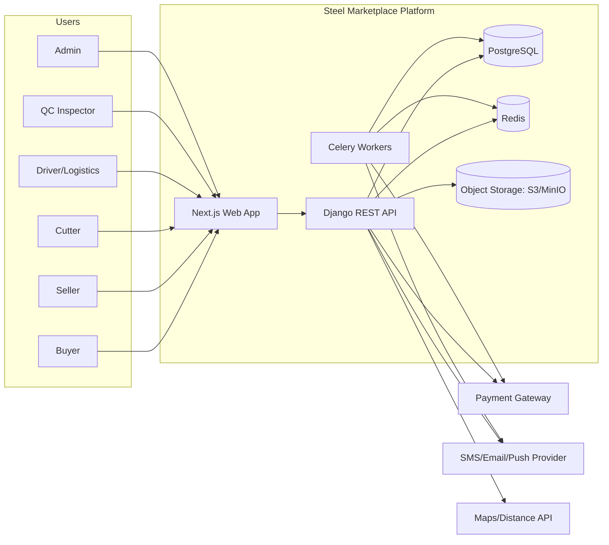
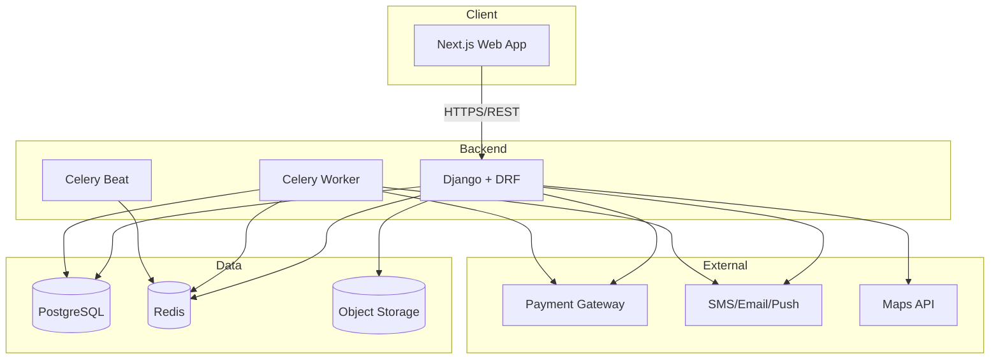
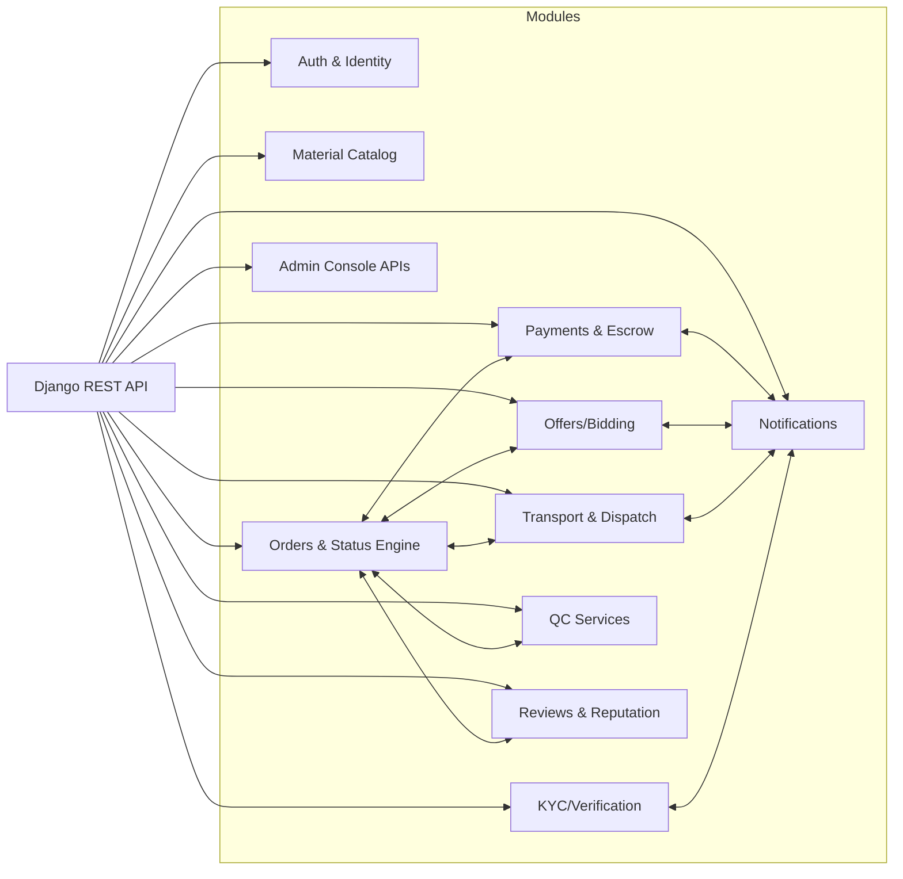

# Architecture

## 1) Overview

This platform is a **B2B marketplace** for **buying/selling steel products** and requesting **industrial services** (cutting, transport, quality inspection) with workflows inspired by on-demand marketplaces (e.g., Uber) and procurement RFQs (Request For Quote).

The backend is implemented in **Python (Django + Django REST Framework)** and exposes a REST API consumed by a **Next.js** frontend. The platform supports multiple user roles per account (buyer, seller, cutter, driver, QC expert, optional structural designer, admin).

Key capabilities:

- **RFQ / reverse auction** style quoting: buyers post requests, providers submit offers, buyer selects.
- **Escrow & milestone payments**: deposits and installments held by the platform until conditions are met.
- **Composite orders**: a parent order can have multiple child orders (goods + service tasks) that progress independently but roll up.
- **Geography-aware matching**: orders are routed to relevant providers based on product/service type and location.
- **Auditability**: status changes, payments, and actions are logged for dispute resolution and compliance.

See Architecture Decision Records (ADRs):

- [ADR-0001: Use Django REST Framework](./adr/0001-use-drf.md)
- [ADR-0002: Composite Order decomposition using parent/child Orders](./adr/0002-order-decomposition.md)
- [ADR-0003: Escrow & milestone payments with ledger-style events](./adr/0003-escrow-payment.md)
- [ADR-0004: State machine enforcement for order lifecycles](./adr/0004-order-state-machine.md)

---

## 2) Goals and Non-goals

### Goals

- Provide a trustworthy online workflow for high-value steel transactions.
- Support multi-party workflows with clear responsibility boundaries:
  - buyer ↔ seller (goods),
  - buyer ↔ service providers (cutting, transport, QC),
  - admin oversight.
- Ensure correctness and safety for:
  - order status transitions,
  - payment milestones,
  - payout conditions.
- Enable geographic filtering and provider matching.
- Provide a clean REST API contract suitable for web/mobile clients.

### Non-goals (initial release)

- Real-time GPS tracking with high-frequency streaming (can be added later).
- Credit/cheque (post-dated) payment instruments (future, requires legal/compliance work).
- Full product catalog with real-time inventory sync across all sellers (MVP can be RFQ-only).
- Complex partial fulfillment across multiple sellers for one RFQ (MVP assumes one selected seller per goods order).

---

## 3) Domain model (conceptual)

### Roles

- Buyer
- Seller
- Cutter (fabricator)
- Driver / Logistics
- QC Inspector
- Structural Designer (optional)
- Admin

**Multi-role accounts** are supported: a user can hold multiple roles simultaneously.

### Core entities

- **User**: identity + roles + verification state (KYC).
- **Provider Profiles** (optional split per role): SellerProfile, DriverProfile, CutterProfile, QCProfile.
- **Warehouse**: seller-owned locations; source of shipments.
- **ProductType / MaterialSpec**: normalized references for product categories + attributes (optional).
- **Order**: unified order record with `order_type`:
  - `BUY` (goods purchase RFQ)
  - `CUT` (cutting service RFQ)
  - `SHIP` (transport job)
  - `QC` (inspection service)
  - `COMBO` (parent container order; may not represent a job itself)
- **Offer**: provider proposal for an order.
- **Payment**: deposit/instalment/final/fee payment records; linked to order.
- **LedgerEntry** (recommended): internal accounting events for escrow, fees, and payouts.
- **Review**: ratings/comments between parties tied to an order.
- **Notification**: persistent notification records (optional) + push/SMS/email send-outs.

### High-level invariants

- Each **BUY/CUT/QC** order can have many offers, but only one *selected offer* (MVP).
- A **COMBO** order can have many child orders; child orders have `parent_order_id`.
- Payments are **milestone-based** and must be consistent with order status.
- Providers cannot see competitors' offers; buyers can.
- Status transitions are validated by a state machine.

---

## 4) C4-style diagrams

### 4.1) System context (C4 Context)



### 4.2) Containers (C4 Container)



### 4.3) Components (C4 Component – backend logical modules)



---

## 5) Backend architecture (Django/DRF)

### 5.1) Recommended Django app/module layout

- `apps/users/`
  - Custom user model, roles, profile(s), KYC status
- `apps/locations/`
  - City/province references, geocoding, service areas
- `apps/catalog/`
  - Product types, material specs (optional in MVP)
- `apps/orders/`
  - Order model, status transitions, child orders
- `apps/offers/`
  - Offer model, selection logic, visibility rules
- `apps/payments/`
  - Payment model, escrow ledger entries, payout logic, gateway callbacks
- `apps/reviews/`
  - Reviews, reputation aggregates
- `apps/notifications/`
  - Notification records + send tasks
- `apps/adminpanel/`
  - Admin endpoints for verification, dispute resolution
- `apps/audit/`
  - Event log, immutable history tables (recommended)

### 5.2) Layering pattern

Avoid putting core business logic directly in DRF viewsets.

Suggested layers:

- **API layer**: serializers, viewsets, permissions, throttling
- **Domain services**: pure functions / service objects encapsulating business rules
- **Repositories** (optional): query helpers for complex fetches
- **State machine**: a module that validates transitions and emits events
- **Task queue**: Celery tasks for async external side-effects (SMS, emails, webhooks)
- **Integrations**: payment gateway client, maps client, notifications client

### 5.3) State machine enforcement

Each order type has a lifecycle (simplified):

- `BUY`:
  - `POSTED` → `OFFER_SELECTED` → `DEPOSIT_PENDING` → `DEPOSIT_PAID`
  - `DEPOSIT_PAID` → `SELLER_CONFIRM_PENDING` → `CONFIRMED`
  - `CONFIRMED` → `PAYMENT_IN_PROGRESS` → `READY_FOR_LOADING`
  - `READY_FOR_LOADING` → `LOADING` → `WEIGHING_PENDING`
  - `WEIGHING_PENDING` → `FINAL_PAYMENT_PENDING` → `FINALIZED`
  - `FINALIZED` → `IN_TRANSIT` → `DELIVERED` → `COMPLETED`
  - Cancel states: `CANCELLED`, `EXPIRED`, `DISPUTED`

- `CUT`:
  - `POSTED` → `OFFER_SELECTED` → `PAYMENT_PENDING` → `IN_PROGRESS` → `COMPLETED`

- `SHIP`:
  - `POSTED` → `DRIVER_ASSIGNED` → `PICKUP_PENDING` → `IN_TRANSIT` → `DELIVERED` → `COMPLETED`

- `QC`:
  - `POSTED` → `EXPERT_ASSIGNED` → `INSPECTION_SCHEDULED` → `IN_PROGRESS`
  - `IN_PROGRESS` → `REPORT_SUBMITTED` → `COMPLETED`

The state machine should be the single source of truth for allowed transitions.
See [ADR-0004](./adr/0004-order-state-machine.md).

---

## 6) Key workflows (sequence diagrams)

### 6.1) Goods purchase RFQ (BUY) with escrow deposit

```mermaid
sequenceDiagram
  participant B as Buyer
  participant FE as Next.js
  participant API as DRF API
  participant S as Seller
  participant PG as Payment Gateway

  B->>FE: Create BUY order (RFQ)
  FE->>API: POST /orders (type=BUY)
  API-->>FE: 201 Created (order_id)
  API-->>S: Notify relevant sellers (async)

  S->>API: POST /orders/{id}/offers
  API-->>B: Notify buyer of new offer (async)

  B->>API: POST /orders/{id}/choose-offer (offer_id)
  API-->>B: Order status -> DEPOSIT_PENDING

  B->>API: POST /orders/{id}/payments (type=DEPOSIT)
  API->>PG: create payment session
  PG-->>B: redirect/payment UX
  PG-->>API: callback/verify transaction
  API-->>B: Payment completed; status -> DEPOSIT_PAID

  S->>API: POST /orders/{id}/confirm-availability
  API-->>B: status -> CONFIRMED
```

### 6.2) Final weight adjustment

```mermaid
sequenceDiagram
  participant API as DRF API
  participant S as Seller
  participant B as Buyer

  S->>API: POST /orders/{id}/record-weight (actual_weight)
  API-->>B: Final invoice computed; status -> FINAL_PAYMENT_PENDING
  B->>API: POST /orders/{id}/payments (type=FINAL_ADJUSTMENT)
  API-->>B: status -> FINALIZED
```

### 6.3) Composite order (COMBO) with CUT and SHIP child orders

```mermaid
sequenceDiagram
  participant B as Buyer
  participant API as DRF API

  B->>API: POST /orders (type=COMBO + child requests)
  API-->>B: 201 (combo_order_id + child_order_ids)
  Note over API: child orders are created with parent_order_id = combo_order_id
  Note over API: Each child progresses independently; parent shows aggregated progress
```

---

## 7) Security and compliance

### 7.1) Authentication

- JWT Bearer tokens for API access.
- Optional 2FA for high-risk actions (e.g., payout setup, large payments).

### 7.2) Authorization (RBAC + object-level)

- Role-based permissions for endpoint access.
- Object-level permissions:
  - Only the buyer and involved providers can access an order.
  - Sellers can only see their own offers and orders they were selected for.
  - Providers only see marketplace “available orders” based on role + geography.

### 7.3) Data protection

- Encrypt secrets (payment keys) via environment variables/secrets manager.
- Store uploaded files in object storage; store only references in DB.
- Ensure PII access is limited and audited.

---

## 8) Observability and operations

- Structured logging (JSON logs) for:
  - order transitions,
  - payment events,
  - external integration calls.
- Metrics (Prometheus) and tracing (OpenTelemetry) recommended for production.
- Admin audit tools for dispute resolution: timeline of events per order.

---

## 9) Deployment reference (recommended)

- Dockerized services:
  - `web` (Next.js)
  - `api` (Django)
  - `worker` (Celery)
  - `beat` (Celery Beat)
  - `db` (Postgres)
  - `redis`
- Environments:
  - Dev (docker-compose)
  - Staging (same stack, separate infra)
  - Prod (Kubernetes or managed services)

---

## 10) Appendix: Status glossary (MVP)

- `POSTED`: request open for offers/acceptance
- `OFFER_SELECTED`: buyer selected a provider offer
- `DEPOSIT_PENDING`: deposit required before proceeding (BUY)
- `DEPOSIT_PAID`: deposit paid and held in escrow
- `SELLER_CONFIRM_PENDING`: waiting seller to confirm inventory/availability
- `CONFIRMED`: seller confirmed; order is active
- `PAYMENT_IN_PROGRESS`: installments ongoing
- `READY_FOR_LOADING`: ready to load/pickup
- `LOADING`: loading in progress
- `WEIGHING_PENDING`: waiting weighbridge result
- `FINAL_PAYMENT_PENDING`: waiting final adjustment payment
- `FINALIZED`: all payments done; goods can leave
- `IN_TRANSIT`: on the way
- `DELIVERED`: delivered to destination, awaiting closure
- `COMPLETED`: closed successfully
- `CANCELLED`: cancelled by user/admin
- `EXPIRED`: expired due to timeouts
- `DISPUTED`: dispute opened
