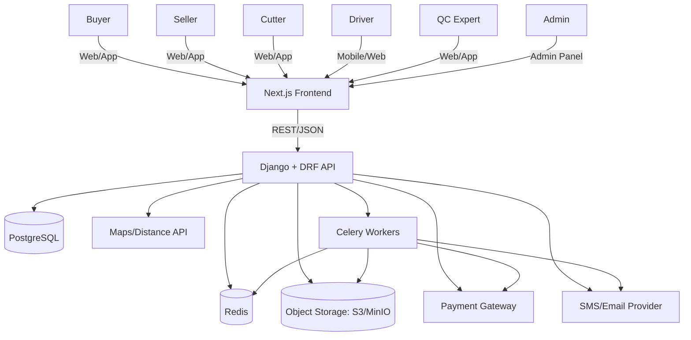
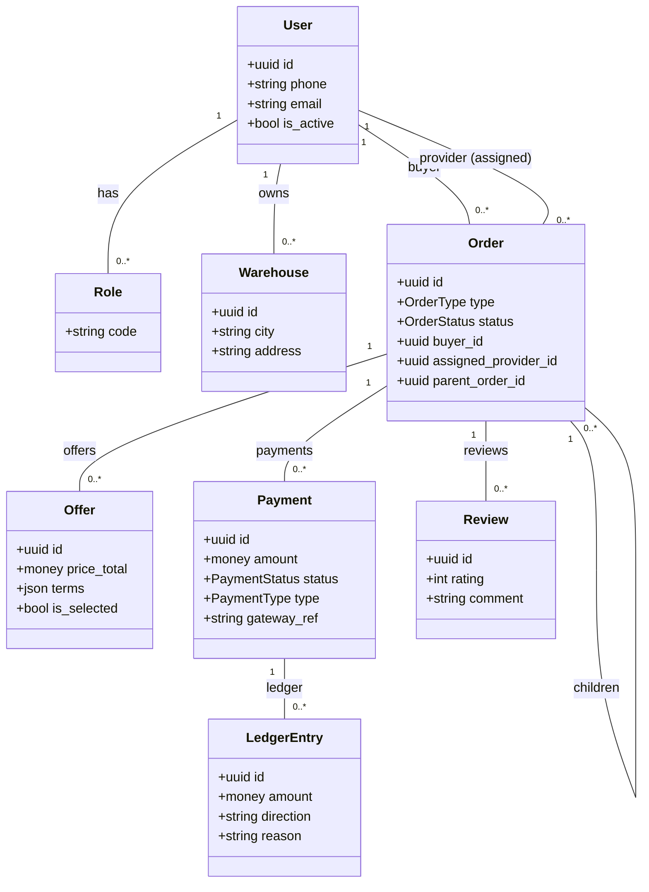
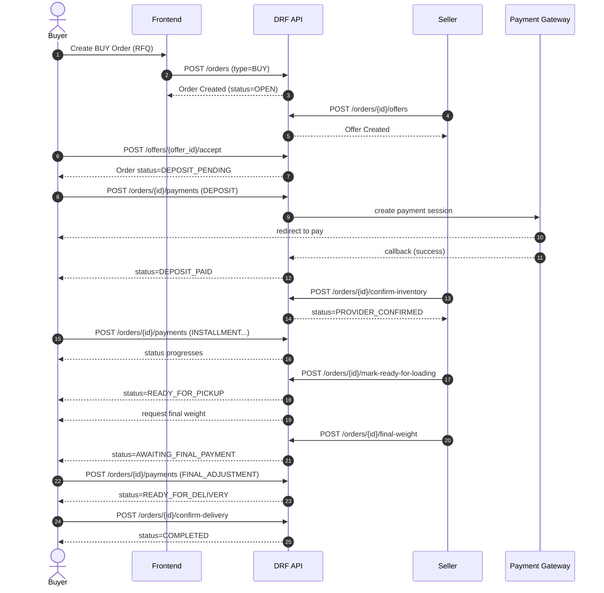

# Architecture (معماری سامانه)

## 1) هدف سند

این سند تصویر «کلان» معماری پلتفرم بازارگاه آهن‌آلات و خدمات صنعتی را ارائه می‌دهد تا:

- تیم‌های Backend/Frontend روی یک زبان مشترک هم‌راستا شوند.
- تصمیم‌های مهم معماری و trade-offها مشخص باشد.
- مسیر توسعه MVP و تکامل تدریجی سیستم شفاف باشد.
- استانداردهای امنیت، پرداخت، وضعیت‌های سفارش و یکپارچگی داده‌ها تعریف شوند.

> تصمیم‌های کلیدی در ADRها ثبت شده‌اند و این سند به آن‌ها ارجاع می‌دهد. (پایین‌تر: بخش 12)

---

## 2) دامنه و مفاهیم اصلی (Domain)

### 2.1) نقش‌ها (Roles)

یک کاربر می‌تواند چند نقش داشته باشد. نقش‌ها:

- خریدار (Buyer)
- فروشنده (Seller)
- برشکار (Cutter)
- راننده/باربری (Driver/Carrier)
- کارشناس (QC)
<!-- - آزمایشگاه (labratory) -->
- طراح سازه (Structural Designer)
- ادمین (Admin)

### 2.2) نوع سفارش‌ها (Order Types)

- **BUY**: سفارش خرید/فروش کالا (RFQ → Offer → انتخاب → پرداخت مرحله‌ای → بارگیری → وزن نهایی → تسویه)
- **SELL**: اعلام فروش/بار توسط فروشنده و انتخاب خریدار (Offer → انتخاب → پرداخت مرحله‌ای → تحویل)
- **CUT**: سفارش برشکاری
- **SHIP**: سفارش حمل‌ونقل
- **QC**: سفارش کنترل کیفیت و گزارش
- **COMBO**: سفارش ترکیبی (والد) که زیرسفارش‌ها را نگه می‌دارد

### 2.3) اصول پایه طراحی

- **RFQ/Offer**: خریدار درخواست ثبت می‌کند؛ ارائه‌دهندگان (فروشنده/خدمت‌دهنده) پیشنهاد می‌دهند؛ خریدار انتخاب می‌کند.
- **SELL Listing**: فروشنده کالا را اعلام می‌کند؛ خریداران پیشنهاد می‌دهند یا انتخاب می‌شوند.
- **Escrow (حساب امن)**: پرداخت‌ها ابتدا نزد پلتفرم نگهداری و سپس طبق رویدادهای موفق آزاد می‌شوند.
- **State Machine**: چرخه عمر سفارش‌ها با وضعیت‌های مشخص و انتقال‌های کنترل‌شده پیاده‌سازی می‌شود.
- **Event/Audit Log**: تغییر وضعیت‌ها و رویدادهای مالی باید قابل ردگیری و ممیزی باشند.

---

## 3) نمای C4 - Context (دیدگاه کلان سیستم)



### توضیح اجزاء بیرونی

- **Payment Gateway**: پرداخت آنلاین و دریافت callback/webhook
- **SMS/Email Provider**: OTP، اعلان پرداخت/مهلت‌ها، اطلاع‌رسانی وضعیت‌ها
- **Maps/Distance API** (اختیاری در MVP): محاسبه فاصله/ETA، پیش‌نمایش هزینه حمل

---

## 4) نمای C4 - Container (کانتینرها و مرزبندی‌ها)

```mermaid
flowchart LR
  subgraph Client
    FE[Next.js App\n(SSR/CSR)]
  end

  subgraph Backend
    API[DRF API\nMonolith]
    Worker[Celery Worker]
    Scheduler[Celery Beat]
  end

  subgraph Data
    DB[(PostgreSQL)]
    Cache[(Redis)]
    Obj[(Object Storage)]
  end

  subgraph External
    Pay[Payment Gateway]
    Notif[SMS/Email/Push]
    Maps[Maps API]
  end

  FE -->|HTTPS REST| API
  API --> DB
  API --> Cache
  API --> Obj
  API --> Pay
  API --> Notif

  Scheduler --> Cache
  Scheduler --> Worker
  Worker --> DB
  Worker --> Cache
  Worker --> Notif
  Worker --> Pay
```

### انتخاب «مونولیت ماژولار» (Modular Monolith)

در فاز اول، یک بک‌اند مونولیت با تفکیک ماژول‌ها (Django apps) بهترین تعادل بین سرعت توسعه و کنترل پیچیدگی است. در آینده می‌توان ماژول‌های حساس (مثلاً پرداخت) را جدا کرد.

ارجاع: ADR-0001 (Use DRF)

---

## 5) معماری Backend (Django/DRF)

### 5.1) ساختار پیشنهادی Django Apps

- `users`: کاربر، نقش‌ها، پروفایل‌ها، احراز هویت، KYC
- `catalog`: نوع محصولات/کالاها، استانداردها، واحدها
- `orders`: سفارش‌ها (BUY/SELL/CUT/SHIP/QC/COMBO)، وضعیت‌ها، لاگ‌ها
- `offers`: پیشنهادها (Offer/Proposal) و مذاکره (در صورت نیاز)
- `payments`: پرداخت‌ها، escrow ledger، تسویه، کارمزدها
- `logistics`: جزئیات حمل‌ونقل (در صورت نیاز مستقل از orders)
- `qc`: گزارش‌ها و نتایج QC
- `reviews`: امتیازدهی و بازخورد
- `notifications`: اعلان‌ها + inbox
- `admin_ops`: ابزارهای مدیریتی و گزارش‌ها

### 5.2) لایه‌بندی پیشنهادی (Clean-ish Architecture)

در DRF معمولاً منطق در View/Serializer می‌ریزد؛ برای جلوگیری از این موضوع:

- **API Layer**: ViewSet/Serializer → فقط validate/transform + فراخوانی سرویس‌ها
- **Service Layer**: کلاس‌ها/توابع use-case مانند `AcceptOffer`, `CreatePayment`, `ConfirmInventory`
- **Domain/Model**: مدل‌های Django + قوانین دامنه (methods) حداقلی
- **Infrastructure**: gateway پرداخت، ارسال SMS، فایل‌ها، map services

**اصل طلایی**: انتقال وضعیت سفارش و عملیات مالی باید در سرویس‌ها انجام شود و view صرفاً orchestration سبک باشد.

### 5.3) اتمیک بودن (Atomicity) و Idempotency

- هر رویداد «حساس» مثل:

  - انتخاب پیشنهاد
  - ثبت پرداخت موفق
  - تایید موجودی فروشنده
  - ثبت وزن نهایی و محاسبه مابه‌التفاوت
  - آزادسازی وجه از escrow
    باید در **transaction.atomic** اجرا شود.

- Endpointهایی مثل callback پرداخت باید **idempotent** باشند (اگر چندبار فراخوانی شد دوباره پول آزاد نشود).

---

## 6) مدل داده (Data Model) - نمای دامنه

### 6.1) موجودیت‌های کلیدی

- `User`
- `Role` (یا enum + many-to-many)
- `Profile` و پروفایل‌های نقش‌محور (SellerProfile, DriverProfile, ...)
- `KYCRequest` و اسناد احراز هویت
- `Warehouse`
- `ProductType` (+ ویژگی‌های استاندارد)
- `Order`
- `OrderItem` (در صورت نیاز برای چند آیتم)
- `Offer`
- `Payment` + `LedgerEntry` (برای escrow)
- `OrderStatusHistory` (لاگ وضعیت)
- `Review`
- `Notification`
- `Attachment` (فایل‌ها: نقشه برش، گزارش QC، فاکتور و ...)

### 6.2) رابطه‌ها (Mermaid Class Diagram)



> نکته: برای MVP می‌توان `OrderItem` را ساده کرد و فقط یک آیتم در `Order` نگه داشت؛ اما برای توسعه (چند محصول/چند ردیف) بهتر است `OrderItem` اضافه شود.

---

## 7) جریان‌های کلیدی (Key Workflows)

### 7.1) خرید کالا (BUY) - توالی رویدادها



### 7.2) فروش کالا (SELL) - توالی رویدادها

**گام‌ها**
1) Seller سفارش SELL ایجاد می‌کند (اعلام بار/کالا)
2) Buyers پیشنهاد خرید ارسال می‌کنند
3) Seller یک پیشنهاد را انتخاب می‌کند
4) Buyer بیعانه پرداخت می‌کند
5) Seller موجودی/آمادگی تحویل را تایید می‌کند
6) پرداخت‌های مرحله‌ای/نهایی و تحویل مشابه BUY انجام می‌شود

### 7.3) خدمات (CUT/SHIP/QC)

همان الگو با تفاوت‌های کوچک:

- در CUT: ممکن است فایل نقشه برش الزامی باشد.
- در SHIP: driver می‌تواند «accept» مستقیم کند (مدل اوبر) یا پیشنهاد قیمت دهد.
- در QC: خروجی یک `QCReport` است و می‌تواند روی تصمیم ادامه خرید اثر بگذارد.

---

## 8) وضعیت‌ها و ماشین حالت (State Machine)

### 8.1) وضعیت‌های عمومی پیشنهادی

- `OPEN` (در انتظار پیشنهاد)
- `OFFER_SELECTED` (پیشنهاد انتخاب شد)
- `DEPOSIT_PENDING`
- `DEPOSIT_PAID`
- `PROVIDER_CONFIRMED`
- `PAYMENT_IN_PROGRESS`
- `READY_FOR_PICKUP`
- `LOADING`
- `LOADED_AWAITING_WEIGHT`
- `AWAITING_FINAL_PAYMENT`
- `READY_FOR_DELIVERY`
- `IN_TRANSIT` (برای SHIP)
- `DELIVERED`
- `COMPLETED`
- `CANCELLED`

> همه وضعیت‌ها برای همه انواع سفارش معنا ندارند؛ اما یک enum مشترک با قوانین انتقال per-order-type، هم کد را ساده می‌کند هم گزارش‌گیری را.

### 8.2) قوانین انتقال نمونه (BUY)

- `OPEN` → `OFFER_SELECTED` (Buyer accepts offer)
- `OFFER_SELECTED` → `DEPOSIT_PENDING` (if deposit required)
- `DEPOSIT_PENDING` → `DEPOSIT_PAID` (payment success)
- `DEPOSIT_PAID` → `PROVIDER_CONFIRMED` (seller confirms inventory)
- `PROVIDER_CONFIRMED` → `PAYMENT_IN_PROGRESS` (installments)
- `PAYMENT_IN_PROGRESS` → `READY_FOR_PICKUP`
- `READY_FOR_PICKUP` → `LOADING` → `LOADED_AWAITING_WEIGHT`
- `LOADED_AWAITING_WEIGHT` → `AWAITING_FINAL_PAYMENT`
- `AWAITING_FINAL_PAYMENT` → `READY_FOR_DELIVERY`
- `READY_FOR_DELIVERY` → `IN_TRANSIT` → `DELIVERED` → `COMPLETED`

### 8.3) توصیه پیاده‌سازی

- از یک سرویس مرکزی مثل `OrderStateService.transition(order, event, actor)` استفاده کنید.
- هر انتقال باید:
  - pre-condition check داشته باشد (role + status + ownership)
  - side effects را ثبت کند (StatusHistory + Notification)
  - در صورت مالی بودن، در transaction انجام شود.

ارجاع: ADR-0004 (Order State Machine)

---

## 9) پرداخت و Escrow

### 9.1) چرا Escrow؟

- مبالغ بالاست و ریسک کلاه‌برداری وجود دارد.
- سرویس‌ها چندمرحله‌ای هستند و ممکن است اختلاف ایجاد شود.
- باید امکان «آزادسازی تدریجی وجه» و «بازگشت وجه» وجود داشته باشد.

### 9.2) مدل پیشنهادی مالی

- `Payment`: تراکنش پرداختی از دید کاربر/درگاه
- `LedgerEntry`: ثبت ورودی/خروجی حساب امن پلتفرم (دفترکل ساده)
- `Payout`: انتقال نهایی به فروشنده/خدمت‌دهنده (می‌تواند فعلاً فقط رکورد باشد)

**اصل کلیدی**: وضعیت سفارش، وضعیت پرداخت، و ورودی/خروجی escrow باید با هم سازگار باشند.

ارجاع: ADR-0003 (Escrow Payment)

---

## 10) امنیت، حریم خصوصی و ممیزی

- احراز هویت: JWT (Access/Refresh)
- RBAC: نقش‌ها + permission کلاس‌های DRF
- Object-level permission: فقط طرفین معامله (Buyer/Assigned Provider/Admin) به داده‌ها دسترسی دارند.
- KYC: برای فعال شدن نقش‌های Seller/Cutter/Driver/QC
- Audit log: ثبت تغییر وضعیت‌ها + رویدادهای مالی + اقدام‌های ادمین
- Rate limiting: برای login/OTP و endpointهای حساس
- Security headers: CSP, HSTS, etc. (در لایه reverse proxy)

---

## 11) Observability و عملیات

- Logging ساخت‌یافته (JSON logs)
- Sentry (خطاهای runtime)
- Metrics (Prometheus) برای:
  - زمان پاسخ API
  - تعداد سفارش‌ها و نرخ تبدیل
  - خطاهای پرداخت
- Tracing (اختیاری)

---

## 12) ADRها (Architecture Decision Records)

- ADR-0001: استفاده از Django REST Framework
- ADR-0002: مدل داده سفارش‌ها و زیرسفارش‌ها (COMBO + parent_order)
- ADR-0003: پیاده‌سازی Escrow/دفترکل برای نگهداشت و آزادسازی پول
- ADR-0004: ماشین حالت وضعیت سفارش‌ها و کنترل انتقال‌ها

مسیر: `docs/architecture/adr/`

---

## 13) ریسک‌ها و نکات عملی

- **محدودیت‌های پرداخت بانکی**: پرداخت مرحله‌ای + چند تراکنش
- **اختلافات**: نیاز به workflow dispute/admin override
- **مکان‌محوری**: داده شهر/استان استاندارد شود؛ در آینده مختصات اضافه شود
- **پرفورمنس**: لیست کردن RFQها و پیشنهادها نیازمند ایندکس‌های مناسب است (status/type/city)
- **امنیت فایل‌ها**: دسترسی به فایل‌های نقشه برش/QC محدود و امضا شده باشد (pre-signed URLs)

---

## 14) مسیر تکامل (Evolution)

### MVP پیشنهادی

- RFQ برای BUY، اعلام فروش برای SELL و خدمات (CUT/SHIP/QC)
- Offers + انتخاب
- پرداخت deposit + تایید موجودی
- وضعیت‌ها + لاگ
- حمل ساده (بدون رهگیری)
- review ساده

### فاز بعد

- سفارش ترکیبی COMBO با ایجاد خودکار زیرسفارش‌ها
- پیشنهاد هوشمند/امتیازدهی ارائه‌دهندگان
- رهگیری لحظه‌ای حمل
- کیف پول و refund داخلی
- dispute center
